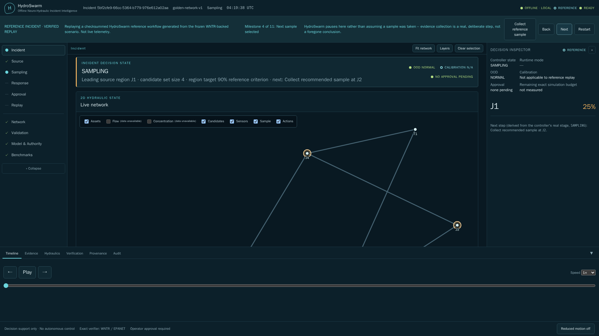
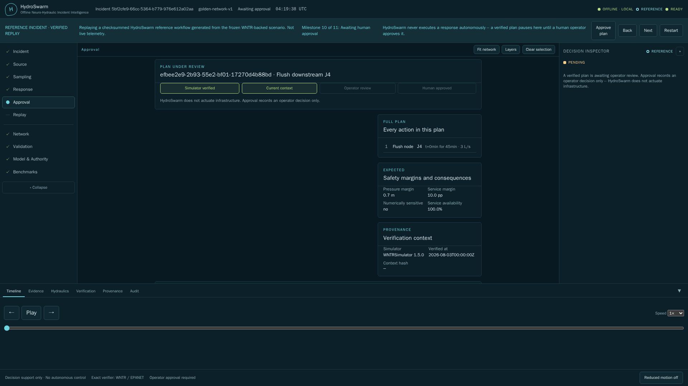
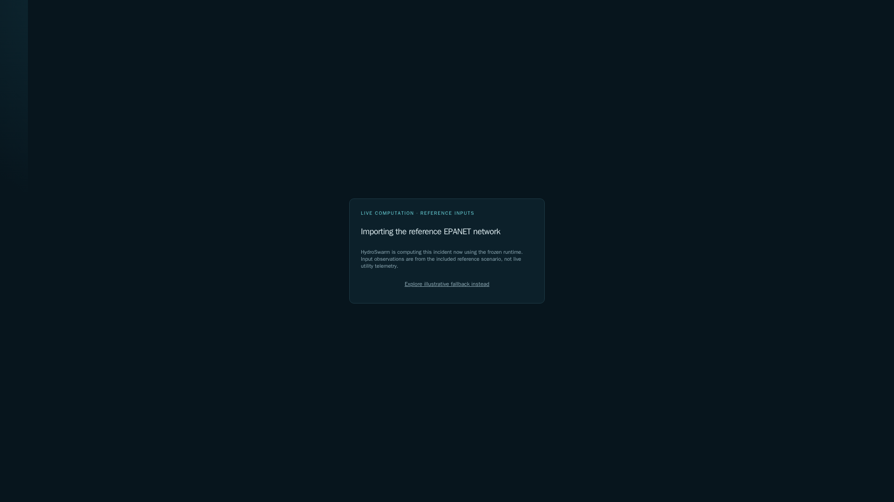
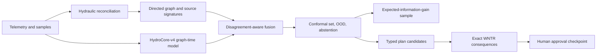

# HydroSwarm

Current development metadata is `0.1.0` (Python package and operator console).
Historical hackathon releases remain historical; a later reviewed submission
commit must receive its own final release/tag.

Offline, physics-verified decision support for drinking-water contamination incidents:
localize the source, choose the next sample, simulate response alternatives with real
hydraulic solvers, and require a human to approve before anything happens.

[](https://github.com/insightlabs38-pixel/HydroSwarm/actions/workflows/ci.yml)

> **Research software, not production control.** HydroSwarm does not identify chemistry,
> guarantee safety, replace utility procedures or laboratory analysis, or execute any
> infrastructure action.


*The first launch makes the provenance choice explicit: start the checksummed
**REFERENCE INCIDENT**, run a real **LIVE** analysis, or use the visibly labeled
illustrative fallback. Nothing shown as reference replay is live telemetry.*

| Reference sampling pause | Human-approval boundary | LIVE V4 proof start |
|---|---|---|
|  |  |  |

## The problem

A utility alert rarely identifies its source. Water flow changes with demand, storage,
pumps, and valves; field evidence is sparse and sensors can drift, freeze, or report the
wrong unit. An intuitive intervention can reduce contaminant exposure while causing low
pressure or lost service. HydroSwarm turns that uncertainty into a visible, auditable
workflow instead of a guess.

## Operator workflow



Alert → initial source uncertainty → evidence judged insufficient → next sample selected
→ sample arrives → posterior contracts → response plans generated → unsafe plan rejected
by exact simulation → safe plan verified → **human approval boundary** → completed,
replayable record. Every stage is a real, hash-chained event in an 18-state deterministic
controller -- nothing is a UI-only illusion of progress.

## Why HydroSwarm is different

- **Physics stays authoritative.** A neural estimate never becomes a `VERIFIED` plan on
  its own -- every candidate response is re-simulated with real WNTR/EPANET hydraulics.
  Timeout, instability, incomplete output, or a pressure/service violation rejects it.
- **Calibrated, not confident-sounding.** Source candidates carry a conformal coverage
  target with measured held-out coverage, five-component out-of-distribution detection,
  and explicit abstention -- not a bare softmax dressed up as a probability.
- **Nothing executes without a person.** The controller has a dedicated, separate
  human-approval pause. No approval event, no action -- ever.
- **Replay is real, not decorative.** Every incident is a hash-chained event ledger;
  replay reproduces the exact same chain, not a re-narrated summary.
- **Fails closed, visibly.** A missing checkpoint, corrupt calibration, unknown topology,
  or WNTR timeout does not silently degrade to a confident-looking answer -- it shows the
  operator exactly which safeguard tripped and why.

## Strongest measured results

**Final system: HydroCore-v4** (frozen, 4.18M parameters, `small` variant) is what this
repository ships and defaults to. See [Final system](docs/FINAL_SYSTEM.md) for the exact
frozen identity, hashes, and authority boundaries.

| Held-out measurement (HydroCore-v4, validation split) | Value |
|---|---:|
| Source localization top-1 | 72.1–73.3% |
| Source top-3 / candidate-set coverage@3 | 86.8–87.6% |
| Mean reciprocal rank | 0.811–0.817 |
| Conformal candidate-set coverage (calibrated) | 91.4% |
| Event-presence detection F1 | 0.895 |
| Frozen release checkpoint | 16.7 MB, SHA-256-verified, self-test gated at container build time |

See [Phase 13 metrics and baselines](reports/results/v4/phase13-metrics-and-baselines.md)
for the full evaluation, including per-class breakdowns and two explicitly-flagged
evaluation caveats the report reports up front rather than hiding.

**Frozen golden scenario** (deterministic, WNTR-backed, regenerable with
`python scripts/run_golden.py`, not a benchmark claim):

| Result | Measured value |
|---|---:|
| Initial source set | 4 nodes / 2.0 bits entropy |
| Selected sample | J2 / 1.0 bit information gain |
| Posterior after sample | J2 at approximately 99.4% |
| Unsafe plan | Rejected: pressure below minimum |
| Verified alternative | J4 flush / modeled service 1.0 |
| Modeled exposure reduction | 14,723 mg vs. no response |
| Replay | Stable 21-event hash chain |

This exact narrative -- alert through human approval -- is also the **REFERENCE
INCIDENT**, a progressive, checksummed replay built from this same frozen scenario. It is
the fastest way to see the real workflow; see [Try it](#try-it) below.

## Try it

**Docker (recommended, no local build):**

```bash
docker compose -f docker-compose.release.yml up
```

**Native setup script** (creates a local `.venv`, verifies the frozen bundle, builds the
console, runs a readiness self-test):

```bash
git clone https://github.com/insightlabs38-pixel/HydroSwarm.git
cd HydroSwarm
./setup_hydroswarm_linux.sh   # or _macos.sh, or _windows.ps1 in PowerShell
./start_hydroswarm_linux.sh   # or _macos.sh, or _windows.ps1
```

Open `http://127.0.0.1:8765`. On first launch with no incident configured, HydroSwarm
offers **Run Reference Incident** (recommended -- a real, checksummed, progressive replay
of the frozen golden scenario), **Run Live Example** (the real production pipeline
computing now against known reference inputs, not a replay), **Import Your Own Network**
(advanced: import a real `.inp` file and start an incident against it), or Explore the
illustrative fallback. Runtime operation makes no internet calls.

See [installation and troubleshooting](docs/INSTALLATION.md) for the full clean-machine,
container, offline, and verification instructions, and [docs/README.md](docs/README.md)
for a full documentation map by audience (judge, user, technical reviewer, researcher).

## Final-system architecture

HydroCore-v4 combines classical physics-derived source signatures with a graph-time
transformer over local edge-aware message passing and bounded global latent attention,
fused with dynamic, disagreement-aware trust weighting. Scout ranks candidate samples by
expected information gain, candidate reduction, delay, cost, and access; Strategist
proposes diverse typed response actions under a hard simulation budget; every candidate is
re-verified by exact WNTR/EPANET simulation before it can be approved. See
[Final system](docs/FINAL_SYSTEM.md) for the authoritative frozen identity and
[Full architecture](docs/ARCHITECTURE.md) for the complete technical description.

## Technical depth

- [Technical brief](docs/TECHNICAL_BRIEF.md) -- one-page summary, links to full depth
- [Final system authority](docs/FINAL_SYSTEM.md) -- the one canonical "what actually ships" page
- [Full architecture](docs/ARCHITECTURE.md)
- [Model card](docs/MODEL_CARD.md)
- [Evaluation protocol](docs/EVALUATION.md)
- [Dataset card](docs/DATASET_CARD.md)
- [Operator guide](docs/USER_GUIDE.md)
- [Judging evidence map](docs/JUDGING.md)
- [Glossary](docs/GLOSSARY.md)

## Limitations

HydroSwarm has not been validated on live utility incidents. WNTR output inherits network,
demand, control, mixing, sensor, and timing errors. A calibrated region may remain broad,
and synthetic held-out results do not establish field generalization. Population exposure
is a proxy without governed demographic/consumption inputs. The local API is not an
authenticated internet-facing multi-tenant service. No `VERIFIED` status is emitted
without completed WNTR results; no plan is `APPROVED` without a separate human event; no
approval causes execution. Read the full
[limitations and failure cases](docs/LIMITATIONS.md) and [security policy](SECURITY.md).

## Application stack

- Scientific runtime: Python, PyTorch, WNTR/EPANET, NetworkX, NumPy, pandas.
- Service: FastAPI, Pydantic, SQLite, bounded local worker, WebSocket updates.
- Console: React, TypeScript, Vite, TanStack Query, Zustand, MapLibre, ECharts,
  Cytoscape, Vitest, accessibility tests, and Playwright.
- Reproducibility: uv, safetensors, Ruff, Pyright, pytest/coverage, pip-audit,
  pre-commit, GitHub Actions, Docker Buildx (multiarch amd64/arm64).

## Repository map

- `src/hydroswarm/classical`, `preprocessing`, `sensors`: physics and evidence quality.
- `src/hydroswarm/model`, `training`, `calibration`: HydroCore and governed learning.
- `src/hydroswarm/inference`, `sampling`, `planning`, `agents`: hybrid decision loop.
- `src/hydroswarm/simulation`, `evaluation`: exact verification and measured proof.
- `src/hydroswarm/api`, `worker`, `storage`, `networks`: durable local service.
- `frontend`: accessible operator console.
- `models/hydrocore-v4-release`: the frozen, hash-verified inference release bundle.
- `artifacts/reference-demo`: the governed REFERENCE INCIDENT artifact.
- `data/frozen`, `reports/results`, `docs`: reproducible submission artifacts and docs.

## Research, evaluation, and historical development

<details>
<summary>Historical HydroCore-S/M/L benchmark (superseded by the frozen HydroCore-v4 above)</summary>

The table below is from an earlier architecture generation, kept for research
transparency -- it is **not** the final shipped system. HydroCore-v4 above is what this
repository ships and defaults to.

A governed 1,320-scenario WNTR corpus contains 800 training, 160 validation, 160
calibration, and 200 test incidents. Five balanced curriculum stages and five hydraulic
regimes are represented; the test regime is excluded from training, signature fitting,
and calibration. All regimes use one reference topology, so this is hydraulic-shift -- not
unseen-topology or field -- evidence.

| Held-out hydraulic-shift result | Top-1 | 95% bootstrap CI |
|---|---:|---:|
| Classical signature baseline | 91.5% | 87.5–95.0% |
| HydroMono-S | 94.5% | 91.5–97.5% |
| HydroCore-S neural | 94.5% | 91.0–97.5% |
| HydroCore-M neural (17 epochs) | 94.5% | 91.0–97.5% |
| HydroCore-M hybrid | 94.0% | 90.5–97.0% |
| HydroCore-S hybrid | **96.0%** | **93.0–98.5%** |

The hybrid improves top-1 by 4.5 percentage points over the identical-scenario classical
baseline. HydroCore-M trained for 17 complete epochs/1,500 steps under a fixed 2,400-second
budget. It does not pass promotion: its hybrid result is two points below S and its mean
scenario latency is 23.93 ms versus 8.94 ms for S. See
[learning-evaluation-final.json](reports/results/learning-evaluation-final.json), the
[M comparison](reports/results/medium-evaluation-final.json),
[dataset report](data/learning-v1/dataset-report.json), and the
[M experiment registry](experiments/learning-v2/hydrocore_m/registry.json).

A separate 70-scenario experiment uses a genuinely different seven-junction branched-loop
EPANET graph; no weights from either generation are fitted on it. Classical, M neural, and
M hybrid top-1 are 35.7%, 47.1%, and 44.3%. The unseen topology hash produces `CAUTION`
with novelty 1.0 and suppresses planning -- evidence of fail-closed behavior, not
topology-transfer capability. See the
[topology-transfer report](reports/results/topology-transfer-m.json).

</details>

<details>
<summary>Reproduce the proof</summary>

```bash
python scripts/run_golden.py --seed 2026
python scripts/build_reference_demo.py
python -m pytest --cov=hydroswarm --cov-branch
python -m ruff check src tests scripts
python -m pyright
cd frontend
npm ci && npm run lint && npm run format:check && npm run test -- --run && npm run build
```

The Python suite contains unit, scientific, integration, end-to-end, and frozen tests.
CI runs on Windows and Ubuntu. Runtime dependencies are hash-locked and `pip-audit`
reports no known vulnerabilities; npm reports zero vulnerabilities.

</details>

<details>
<summary>Data generation and training</summary>

```bash
python scripts/generate_cycle_b_corpus.py --help
python scripts/rebuild_normalized_shards.py --help
python scripts/train.py --help
python scripts/build_signatures.py --help
python scripts/calibrate.py --help
python scripts/build_v4_inference_release_bundle.py --help
python scripts/benchmark_performance.py --variant small --nodes 128 --stress-nodes 1000
```

The WNTR generator includes incident, hydraulic, topology, sensor, timing, missingness,
drift, outage, jitter, unit, and flow-reversal variation. Network-disjoint split ownership
is assigned before simulation; manifests record hashes and provenance; validators enforce
finite values, aligned masks/time, replay, and leakage constraints. See
[data generation and governance](docs/DATA_GENERATION.md), the
[dataset card](docs/DATASET_CARD.md), and [model card](docs/MODEL_CARD.md).

</details>

## Submission and documentation

- [Documentation map](docs/README.md) -- start here for a path by audience
- [Final system authority](docs/FINAL_SYSTEM.md)
- [Problem and product boundary](docs/PROBLEM.md)
- [Judging evidence map](docs/JUDGING.md)
- [Four-minute demo script](docs/VIDEO_SCRIPT.md)
- [Devpost draft](docs/DEVPOST.md)
- [Submission checklist](docs/SUBMISSION_CHECKLIST.md)
- [References](docs/REFERENCES.md)

The final video URL remains intentionally unset until the recorded real-output run has
been reviewed and uploaded; the repository does not present a placeholder as a finished
demo.

## AI-assisted development

ChatGPT/Codex and Claude/Claude Code were used for implementation assistance, debugging,
test generation, documentation review, and architecture critique. The project author
selected the architecture, scientific objectives, evaluation methodology, claims, and
final implementation, and validated the submitted system. See the full
[AI-assistance disclosure](docs/AI_ASSISTANCE.md). Hosted AI services are not runtime
dependencies.

## License

Apache-2.0. See [LICENSE](LICENSE). Dataset and third-party software licenses remain their
respective owners' terms.
