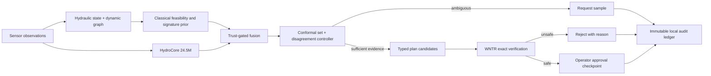

# HydroSwarm

HydroSwarm is an offline, physics-first decision-support system for drinking-water
contamination incidents. It combines dynamic hydraulic graphs, approximate Bayesian
source localization, a 24.5M-parameter graph/time-series model, active sampling, and
authoritative WNTR simulation. It never operates infrastructure: every response plan
must pass deterministic constraints and an exact simulator check, then wait for a human
operator's approval.

> **Research software, not production control.** HydroSwarm does not identify chemistry,
> guarantee safety, or replace utility procedures, laboratory analysis, or qualified
> engineering judgment.

## What the core loop proves

1. Generate or import an elevation-aware water network.
2. Ingest delayed, noisy, drifting, or missing sensor observations.
3. Screen physically feasible sources on a flow-directed hydraulic graph.
4. Fuse classical source signatures with HydroCore only after measuring disagreement.
5. Request a useful sample when uncertainty remains.
6. Generate typed operational plans—not chatbot prose.
7. reject infeasible or unsafe actions through WNTR and pressure/service constraints.
8. Require explicit operator approval and append every transition to a tamper-evident
   local SQLite event ledger.

Every inference run can report localization accuracy, calibrated candidate-set coverage,
candidate-set size, information gain per sample, pressure violations, and abstention
quality. These are measurement hooks; no unmeasured real-world performance claim is made.

## Quick start

Python 3.12 is required. The application is local-only and makes no runtime network calls.

```powershell
python -m venv .venv
.venv\Scripts\python -m pip install -e ".[console,dev]"
.venv\Scripts\hydroswarm self-test
.venv\Scripts\hydroswarm start
```

The API listens on `127.0.0.1:8765`. In a second terminal, start the console:

```powershell
.venv\Scripts\streamlit run src/hydroswarm/console/app.py
```

For the currently provisioned environment, `python -m pytest` runs without installation
because the repository config adds `src` to the test path.

## Architecture



The four runtime modes degrade safely: full hybrid, smaller/degraded hybrid, classical
safe mode, and simulation-only plan comparison.

## Repository map

- `src/hydroswarm/data`: deterministic imperfect-condition scenario generation.
- `src/hydroswarm/classical`: hydraulic graphs, feasibility screening, signature priors,
  and operational metrics.
- `src/hydroswarm/model`: HydroCore encoders, backbone, specialist adapters, and heads.
- `src/hydroswarm/inference`: trust-gated fusion, conformal sets, and abstention control.
- `src/hydroswarm/simulation`: WNTR network construction and hard plan verification.
- `src/hydroswarm/domain`: strict Pydantic JSON contracts.
- `src/hydroswarm/storage`: append-only SQLite provenance.
- `src/hydroswarm/api` and `src/hydroswarm/console`: local operator interfaces.

## Verification

```powershell
python -m pytest
python -m compileall -q src
python -m pip check
```

Scientific regression tests cover probability normalization, flow reversal, missing and
drifting sensors, delayed observations, deterministic replay, dynamic trust, conformal
calculation, invalid actions, pressure thresholds, immutable events, and the human
approval checkpoint.

## Security and privacy

The application binds to loopback by default, performs no URL fetching, executes no shell
commands from user input, validates typed payloads, and stores incident state locally.
Imported network support must validate extension, size, path containment, and content
before production use. See [Security](docs/SECURITY.md).

## Documentation

- [Model card](docs/MODEL_CARD.md)
- [Synthetic dataset card](docs/DATASET_CARD.md)
- [Evaluation protocol](docs/EVALUATION.md)
- [Security and limitations](docs/SECURITY.md)

## AI-assisted development disclosure

AI coding tools assisted implementation, test generation, and documentation. The project
owner remains responsible for reviewing the code, validating scientific claims, licensing,
security, and submission accuracy. HydroSwarm has no runtime dependency on a hosted AI
service.

