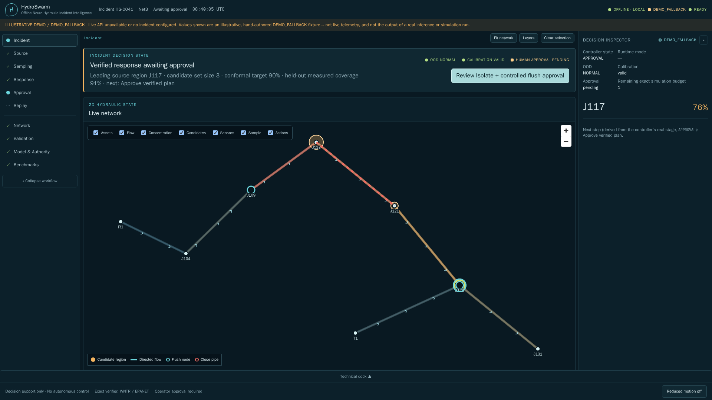
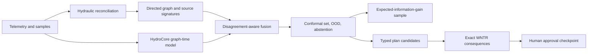

# HydroSwarm

Offline multi-agent intelligence that localizes water-quality incidents, selects evidence,
and verifies response plans with hydraulic simulation.

[](https://github.com/insightlabs38-pixel/HydroSwarm/actions/workflows/ci.yml)

HydroSwarm is a local, physics-first decision-support system for drinking-water
contamination incidents. It reconciles imperfect telemetry, estimates a calibrated source
region, recommends the next informative sample, compares diverse response alternatives
against no response, and requires exact WNTR verification plus explicit human approval.

> **Research software, not production control.** HydroSwarm does not identify chemistry,
> guarantee safety, replace utility procedures or laboratory analysis, or execute any
> infrastructure action.

## The problem

A utility alert rarely identifies its source. Water flow changes with demand, storage,
pumps, and valves; field evidence is sparse and sensors can drift, freeze, or report the
wrong unit. An intuitive intervention can reduce contaminant exposure while causing low
pressure or lost service. HydroSwarm turns uncertainty into a visible workflow: localize,
choose evidence, simulate alternatives, reject unsafe candidates, and wait for a person.

## Measured golden scenario

All values below are regenerated from the checked-in frozen WNTR/EPANET scenario. They are
regression measurements, not field-performance claims.

| Result | Measured value |
|---|---:|
| Initial source set | 4 nodes / 2.0 bits entropy |
| Selected sample | J2 / 1.0 bit information gain |
| Posterior after sample | J2 at approximately 99.4% |
| Candidate contraction | 4 to 1 |
| Unsafe plan | Rejected: pressure below minimum |
| Verified alternative | J4 flush / modeled service 1.0 |
| No-response modeled consumption | 2,541,416 mg |
| Verified-plan modeled consumption | 2,526,693 mg |
| Modeled reduction | 14,723 mg |
| Replay | Stable 21-event hash chain |
| Repeated-seed promotion gate | PASS |

## Measured learned benchmark

A governed 1,320-scenario WNTR corpus contains 800 training, 160 validation, 160
calibration, and 200 test incidents. Five balanced curriculum stages and five hydraulic
regimes are represented; the test regime is excluded from training, signature fitting,
and calibration. All regimes use one reference topology, so this is hydraulic-shift—not
unseen-topology or field—evidence.

| Held-out hydraulic-shift result | Top-1 | 95% bootstrap CI |
|---|---:|---:|
| Classical signature baseline | 91.5% | 87.5–95.0% |
| HydroMono-S | 94.5% | 91.5–97.5% |
| HydroCore-S neural | 94.5% | 91.0–97.5% |
| HydroCore-M neural (17 epochs) | 94.5% | 91.0–97.5% |
| HydroCore-M hybrid | 94.0% | 90.5–97.0% |
| HydroCore-S hybrid | **96.0%** | **93.0–98.5%** |

The hybrid improves top-1 by 4.5 percentage points over the identical-scenario classical
baseline. HydroCore-M trained for 17 complete epochs/1,500 steps under a fixed 2,400-second
budget. It does not pass promotion: its hybrid result is two points below S and its mean
scenario latency is 23.93 ms versus 8.94 ms for S. M improves start-time accuracy from
20.5% to 27.0% and strength-bin accuracy from 34.0% to 45.5%, but duration falls from
42.5% to 35.5%; these heads remain exploratory. M calibration, fit only on the calibration
split, reaches 91.0% held-out coverage with mean set size 0.93 and ECE 0.0367. See
[learning-evaluation-final.json](reports/results/learning-evaluation-final.json), the
[M comparison](reports/results/medium-evaluation-final.json),
[dataset report](data/learning-v1/dataset-report.json), and the
[M experiment registry](experiments/learning-v2/hydrocore_m/registry.json).

A separate 70-scenario experiment uses a genuinely different seven-junction branched-loop
EPANET graph; no M weights are fitted on it. Classical, M neural, and M hybrid top-1 are
35.7%, 47.1%, and 44.3%. Conformal coverage drops to 27.1% with mean set size 0.41. The
unseen topology hash produces `CAUTION` with novelty 1.0 and suppresses planning. This is
evidence of fail-closed behavior, not topology-transfer capability. See the
[topology-transfer report](reports/results/topology-transfer-m.json).

The promoted 4.04M-parameter S checkpoint is 16.19 MB, hash-verified, and executes through
the default API in `FULL_HYBRID` mode with compatible calibration and provenance. The
[pipeline validation](reports/results/trained-pipeline-validation.json) records a complete
real-checkpoint run. Corrupt, absent, or schema-incompatible assets fail closed to the
classical path.

The separate seeded HydroCore-S FP32 runtime profile (random weights, runtime evidence only) measures
31.00 ms median / 32.34 ms p95 at 128 nodes and 104.33 ms median at 1,000 nodes on this
4-thread CPU host. The 4.04M-parameter safetensors artifact is 16.19 MB and repeated eager
outputs match exactly. See [performance.json](reports/results/performance.json); these are
not accuracy measurements.

The frozen golden workflow report retains its original neural-variant fields for regression
compatibility; learned results are reported in the separate governed benchmark above. See the
[machine-readable golden evaluation](reports/results/evaluation_results.json),
[measured summary](reports/results/summary.md), and
[technical report](output/pdf/HydroSwarm_Technical_Report.pdf).

The operator screenshot below uses the console's visibly labeled deterministic fallback to
demonstrate the interface when no active API incident is configured; it is not presented as
live telemetry or benchmark evidence.



## How it works



- Classical physics remains usable without a checkpoint and explains feasibility and
  residuals.
- HydroCore uses local edge-aware graph processing and bounded global latent attention;
  S/M/L variants contain 4.0M, 12.4M, and 24.4M parameters.
- Dynamic trust responds to sensor health, classical/neural disagreement, calibration
  validity, and five-component OOD evidence.
- Scout ranks samples by information gain, candidate reduction, detection probability,
  delay, cost, redundancy, duplicates, and access.
- Strategist produces diverse typed actions under hard budgets. WNTR is authoritative;
  timeout, instability, incomplete output, or pressure/service failure rejects a plan.
- The 18-state controller is deterministic, idempotent, bounded, replayable, and contains
  separate sampling and human-approval pauses.

## Install and run locally

Python 3.12 is required; Node.js 22 is needed only to rebuild the frontend.

```powershell
git clone https://github.com/insightlabs38-pixel/HydroSwarm.git
cd HydroSwarm
python -m venv .venv
.venv\Scripts\python -m pip install -e ".[dev]"
cd frontend
npm.cmd ci
npm.cmd run build
cd ..
.venv\Scripts\hydroswarm self-test
.\start_hydroswarm.bat
```

Open `http://127.0.0.1:8765`. Runtime operation makes no internet calls. Linux/macOS users
can run `./start_hydroswarm.sh`. Container deployment is `docker compose build` followed by
`docker compose up`; it publishes loopback only and uses a hardened, read-only container.

See [installation and troubleshooting](docs/INSTALLATION.md) for clean-machine,
container, offline, and verification instructions.

## Reproduce the proof

```powershell
python scripts/run_golden.py --seed 2026
python scripts/evaluate.py --config configs/evaluation.yaml
python -m pytest --cov=hydroswarm --cov-branch
python -m ruff check src tests scripts
python -m pyright
python -m build --wheel --no-isolation
cd frontend
npm.cmd run lint
npm.cmd run format:check
npm.cmd run test -- --run
npm.cmd run build
npm.cmd run test:e2e
```

The Python suite currently contains unit, scientific, integration, end-to-end, and frozen
tests. The integrated pre-submission run is recorded only after re-running every gate.
CI runs on Windows and Ubuntu. Runtime dependencies are hash-locked and `pip-audit` reports
no known vulnerabilities; npm reports zero vulnerabilities.

## Data generation and training

```powershell
python scripts/generate_dataset.py --output data/processed --count 100 --seed 2026
python scripts/prepare_training_corpus.py --output data/learning-v1
python scripts/rebuild_canonical_tensors.py
python scripts/train.py --config configs/training_benchmark.yaml --train-manifest data/learning-v1/tensors-canonical-v3/train.jsonl --validation-manifest data/learning-v1/tensors-canonical-v3/validation.jsonl
python scripts/evaluate_learning.py --help
python scripts/build_signatures.py --output models/signatures
python scripts/calibrate.py --help
python scripts/train.py --help
python scripts/export_openvino.py --help
python scripts/benchmark_performance.py --variant small --nodes 128 --stress-nodes 1000
```

The WNTR generator includes incident, hydraulic, topology, sensor, timing, missingness,
drift, outage, jitter, unit, and flow-reversal variation. Network-disjoint split ownership
is assigned before simulation; manifests record hashes and provenance; validators enforce
finite values, aligned masks/time, replay, and leakage constraints. See
[data generation and governance](docs/DATA_GENERATION.md), the
[dataset card](docs/DATASET_CARD.md), and [model card](docs/MODEL_CARD.md).

## Application stack

- Scientific runtime: Python, PyTorch, WNTR/EPANET, NetworkX, NumPy, pandas.
- Service: FastAPI, Pydantic, SQLite, bounded local worker, WebSocket updates.
- Console: React, TypeScript, Vite, TanStack Query, Zustand, MapLibre, ECharts,
  Cytoscape, Vitest, accessibility tests, and Playwright.
- Reproducibility: uv, safetensors, Ruff, Pyright, pytest/coverage, pip-audit,
  pre-commit, GitHub Actions, Docker Compose.

The production entry bundle is 237.79 KB (74.74 KB gzip); the heavier tile-free map,
hydraulic chart, and topology engines load only when needed.

## Repository map

- `src/hydroswarm/classical`, `preprocessing`, `sensors`: physics and evidence quality.
- `src/hydroswarm/model`, `training`, `calibration`: HydroCore and governed learning.
- `src/hydroswarm/inference`, `sampling`, `planning`, `agents`: hybrid decision loop.
- `src/hydroswarm/simulation`, `evaluation`: exact verification and measured proof.
- `src/hydroswarm/api`, `worker`, `storage`, `networks`: durable local service.
- `frontend`: accessible operator console.
- `data/frozen`, `reports/results`, `output/pdf`: reproducible submission artifacts.

## Safety, limitations, and claims

HydroSwarm has not been validated on live utility incidents. WNTR output inherits network,
demand, control, mixing, sensor, and timing errors. A calibrated region may remain broad,
and synthetic held-out-network results do not establish field generalization. Population
exposure is a proxy without governed demographic/consumption inputs. The local API is not
an authenticated internet-facing multi-tenant service.

No `VERIFIED` status is emitted without completed WNTR results; no plan is `APPROVED`
without a separate human event; no approval causes execution. Read the full
[limitations and failure cases](docs/LIMITATIONS.md) and [security policy](SECURITY.md).

## Submission and documentation

- [Problem and product boundary](docs/PROBLEM.md)
- [Full architecture](docs/ARCHITECTURE.md)
- [Operator guide](docs/USER_GUIDE.md)
- [Evaluation protocol](docs/EVALUATION.md)
- [Judging evidence map](docs/JUDGING.md)
- [Four-minute demo script](docs/VIDEO_SCRIPT.md)
- [Devpost draft](docs/DEVPOST.md)
- [Submission checklist](docs/SUBMISSION_CHECKLIST.md)
- [References](docs/REFERENCES.md)

The final video URL remains intentionally unset until the recorded real-output run has
been reviewed and uploaded; the repository does not present a placeholder as a finished
demo.

## AI-assisted development

ChatGPT/Codex and Claude/Claude Code were used for implementation assistance, debugging,
test generation, documentation review, and architecture critique. The project author
selected the architecture, scientific objectives, evaluation methodology, claims, and
final implementation, and validated the submitted system. See the full
[AI-assistance disclosure](docs/AI_ASSISTANCE.md). Hosted AI services are not runtime
dependencies.

## License

Apache-2.0. See [LICENSE](LICENSE). Dataset and third-party software licenses remain their
respective owners' terms.
