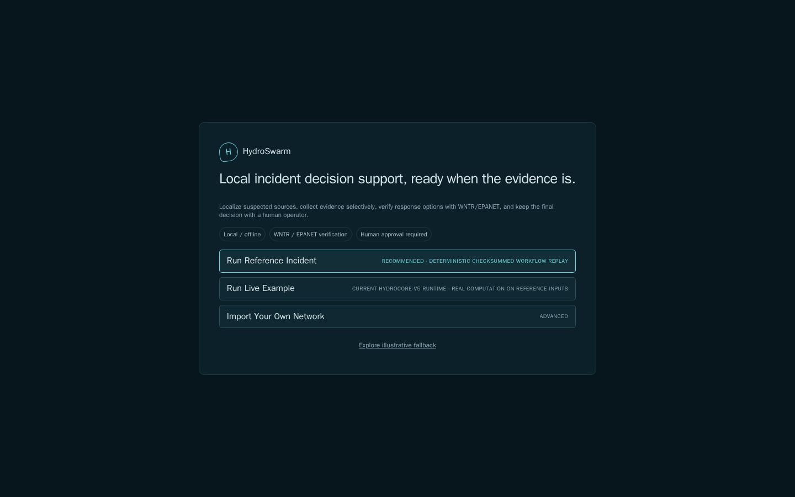
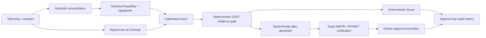

# HydroSwarm

Offline, physics-verified decision support for drinking-water contamination incidents. HydroSwarm combines hydraulic simulation, classical source signatures, and a governed HydroCore-v5 learned Sentinel to localize plausible sources, recommend the next evidence to collect, compare response alternatives, and stop at an explicit human-approval boundary. Learned outputs are advisory: deterministic controls decide whether sampling or planning is allowed, WNTR/EPANET is required to verify a response plan, and HydroSwarm contains no autonomous actuation connector.

[](https://github.com/insightlabs38-pixel/HydroSwarm/actions/workflows/ci.yml)

> **Start here: [Executive Summary](docs/EXECUTIVE_SUMMARY.md).** A 5–10 minute explanation of the problem, system, results, limitations, and why HydroSwarm is designed to fail closed.

> **Research software, not production control.** All reported model/evaluation data are synthetic. HydroSwarm does not identify contaminant chemistry, certify water safety, replace laboratory or utility procedures, or execute infrastructure actions.



*Screenshots ([more in docs/screenshots](docs/screenshots)) document the operator experience and provenance labels; they are not evidence of the current model identity. Final V5 identity and results are tied to immutable artifacts below.*

## What HydroSwarm does



HydroSwarm is deliberately hybrid. The learned branch estimates five governed Sentinel outputs; classical hydraulic evidence remains visible; conformal calibration exposes a candidate region when applicable; deterministic OOD control can suppress planning; deterministic Scout logic ranks valid unsampled locations; deterministic planning proposes bounded candidates; and exact simulation is required before a plan can become `VERIFIED`.

The authority sequence is **ADVISORY → CALIBRATED ADVISORY → DETERMINISTIC → SIMULATOR_VERIFIED → HUMAN_APPROVED**. See [Authority and safety](docs/AUTHORITY_AND_SAFETY.md).

## Final system: HydroCore-v5

The frozen finalist is **HydroCore-v5 M10 frozen release**, `small`, 4,182,612 parameters, selected seed `20260814`.

| Frozen identity | Value |
|---|---|
| Checkpoint SHA-256 | `de2b3f56243a1933d1d7c5957cd74a29fade119f7d104ce7f1500b3dd7b6d2a5` |
| Release manifest SHA-256 | `f3fb08642738128f020c50e20e6b68c417bf80703f7ef6bc8f42db2aa41f8d34` |
| Calibration file SHA-256 | `8f77f06b72316455e1f8040dbeb5907503e4eb623dd527d9ea809a56e96c046d` |
| Calibration artifact hash | `f2503e856c467eb38c6c7f6dbde679527c1921925941ec52809bd6e8e6dd16dd` |
| Calibration | split conformal, alpha `0.1`, `B_DEPTH_AWARE` |
| Learned runtime outputs | `source_node`, `event_presence`, `event_cause`, `evidence_sufficiency`, `relative_strength` |
| Trained task family | `sentinel` |
| Default serving factory | `V5PipelineFactory(resolve_v5_bundle_dir())` |

The architecture contains optional Scout/Strategist/OOD and consequence heads, but the frozen evidence does **not** promote those heads to operational authority. `next_step` and the learned Scout/Strategist/OOD outputs are suppressed/non-authoritative. The authoritative frozen record is [Final system](docs/FINAL_SYSTEM.md), backed by the [M11.2 finalist freeze](reports/evaluation/hydrocore-v5/m11/m11-2/finalist-freeze.json) and [V5 runtime manifest](models/hydrocore-v5-release/runtime_manifest.json).

## Final locked evaluation

M11.6 executed exactly once after finalist freeze, locked-population materialization, and explicit authorization. The terminal result is **PASS** for both locked-final and locked-topology gates: 105 locked-final incidents + 20 locked-topology incidents = **125/125 complete**, with **0 of 15 hard safety counters violated**, one authorized opening, no locked rerun, and no post-lock tuning.

| Population | n | Top-1 | Top-3 | MRR | Conformal coverage | Actionable |
|---|---:|---:|---:|---:|---:|---:|
| Nominal locked-final | 15 | 73.3% | 86.7% | 0.821 | 93.3% | 80.0% |
| All locked-final stress conditions | 105 | 55.2% | 76.2% | 0.687 | 88.6% | 61.0% |
| Novel topology | 20 | 55.0% | 70.0% | 0.652 | **not applicable** (`calibrated_rate=0`) | **0.0%** |

On the novel-topology population, human-approved rate was also **0.0%** and the fail-closed topology gate passed. Its predictive metrics are explicitly **descriptive/non-gating**: they show retained localization signal under genuine topology shift, not calibrated operational authority.

The aggregate stress matrix is materially weaker than the nominal subset, especially under ambiguity, measurement noise, and sensor dropout. That gap is part of the result, not hidden. See the full [Scientific evidence dossier](docs/SCIENTIFIC_EVIDENCE.md), [M11.6 metrics](reports/evaluation/hydrocore-v5/m11/m11-6-final/m11-6-metrics.json), [gate](reports/evaluation/hydrocore-v5/m11/m11-6-final/m11-6-gate.json), and [safety counters](reports/evaluation/hydrocore-v5/m11/m11-6-final/m11-6-safety-counters.json).

## Try the current V5 source

### Docker from this checkout

```bash
docker compose build
docker compose up
```

Open `http://127.0.0.1:8765`.

### Native

```bash
git clone https://github.com/insightlabs38-pixel/HydroSwarm.git
cd HydroSwarm
./setup_hydroswarm_linux.sh   # or _macos.sh / _windows.ps1
./start_hydroswarm_linux.sh   # or matching platform launcher
```

The current API default serves V5 and `hydroswarm self-test --strict` validates the V5 release bundle; the native setup scripts, the runtime ZIP builder, `RELEASE_MANIFEST.json` generation, and the Docker image now all resolve exclusively to the same V5 bundle, with no current-path dependency on the historical V4 bundle. One packaging caveat remains: `docker-compose.release.yml` is still pinned to the historical `v0.1.0-hackathon` image, which predates the V5 bundle, so it is **not yet** the V5 launch path -- a new immutable image tag must be published first. See [Installation](docs/INSTALLATION.md) for exact behavior.

## Authority and safety boundaries

- A learned output cannot mark a plan `VERIFIED`.
- Deterministic `OODDetector`, `rank_sample_locations`, and `generate_response_plans` retain operational authority around the learned Sentinel.
- Unknown/unsupported topology or invalid calibration can suppress planning rather than silently extrapolate authority.
- Every actionable plan must complete exact WNTR/EPANET verification.
- Evidence changes stale prior verification; stale plans cannot be approved.
- Approval is a separate human event.
- HydroSwarm has no autonomous actuation path.

These are architectural boundaries and measured locked-evaluation invariants; they do not establish real-world utility safety.

## Documentation

For a fast technical review:

- [Scientific evidence](docs/SCIENTIFIC_EVIDENCE.md) — final locked matrix, gates, provenance, limitations.
- [Judging evidence map](docs/JUDGING.md) — 2-minute, 5-minute, and deep-review paths.
- [Final system](docs/FINAL_SYSTEM.md) — frozen identity and authority.
- [Architecture](docs/ARCHITECTURE.md) — end-to-end technical design.
- [Model card](docs/MODEL_CARD.md) — intended use, supervision, calibration, stress behavior.
- [Evaluation](docs/EVALUATION.md) — M9 → M10 → M11 lifecycle and one-time lock.
- [Dataset card](docs/DATASET_CARD.md) — training/development/locked populations.
- [Reproducibility](docs/REPRODUCIBILITY.md) — verify hashes and immutable evidence without rerunning M11.6.
- [Claims and evidence](docs/CLAIMS_AND_EVIDENCE.md) — auditable claim ledger.
- [Full documentation map](docs/README.md).

## Limitations

All scientific evidence is simulation-based. Nominal locked performance does not imply equal performance under sensor dropout, ambiguity, noise, severity shift, or unseen topology. Conformal coverage is marginal over applicable populations, not per-incident confidence. Novel-topology calibration was inapplicable in the locked topology split; predictive metrics there are descriptive only. WNTR/EPANET inherits network-model, demand, control, mixing, timing, and sensor assumptions. HydroSwarm has not been validated on live utility incidents and does not determine chemistry, toxicity, pathogens, or regulatory safety.

Read [Limitations and failure cases](docs/LIMITATIONS.md) before interpreting results operationally.

## Application stack

Python, PyTorch, WNTR/EPANET, NetworkX, NumPy, pandas; FastAPI, Pydantic, SQLite; React/TypeScript/Vite; safetensors, pytest, Ruff, Pyright, GitHub Actions, and Docker.

## Historical research

HydroCore-v4 and the earlier HydroCore-S/M/L program remain preserved as historical evidence. Their old validation or locked-test numbers are not current V5 claims. Start with [Final system](docs/FINAL_SYSTEM.md) for the current authority, then use [Evaluation](docs/EVALUATION.md#historical-record) for pointers to superseded generations.

## AI-assisted development

ChatGPT/Codex, Claude/Claude Code, and Codebuff were used for implementation assistance, debugging, testing, documentation review, and architecture critique. Scientific objectives, evaluation governance, claims, and release decisions remained human-governed. These tools are not runtime dependencies; HydroCore-v5 is a locally trained scientific model, not a hosted LLM. See [AI assistance](docs/AI_ASSISTANCE.md).

## License

Apache-2.0. See [LICENSE](LICENSE).
