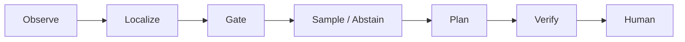

---
hide:
  - toc
---

# HydroSwarm

**Offline, physics-first decision support for drinking-water contamination incidents.**

HydroSwarm helps responders narrow plausible sources, decide whether another sample would meaningfully reduce uncertainty, compare response options against the hydraulic network, and stop before field action at an explicit human-approval boundary.

[Watch the 3:23 demo](https://vimeo.com/1220385465?share=copy&fl=sv&fe=ci#t=0){ .md-button .md-button--primary }
[GitHub](https://github.com/insightlabs38-pixel/HydroSwarm){ .md-button }
[Devpost](https://devpost.com/software/hydroswarm){ .md-button }
[Run v0.2.1](INSTALLATION.md){ .md-button }

> **Research software, not production control.** All reported model and evaluation data are synthetic. HydroSwarm does not identify contaminant chemistry, certify water safety, replace laboratory or utility procedures, or execute infrastructure actions.

## Choose your review path

-   **Quick review · 5–10 min**

    Understand the problem, workflow, headline results, and limitations without reading the model internals.

    [Executive Summary](EXECUTIVE_SUMMARY.md) → [Problem & Impact](PROBLEM.md) → [Scientific Evidence](SCIENTIFIC_EVIDENCE.md)

-   **Technical review · 10–20 min**

    Inspect the software architecture, authority separation, simulator verification, and evidence trail.

    [Architecture](ARCHITECTURE.md) → [Final System](FINAL_SYSTEM.md) → [Authority & Safety](AUTHORITY_AND_SAFETY.md) → [Judging Evidence Map](JUDGING.md)

-   **Scientific / ML review**

    Audit supervision scope, calibration applicability, split governance, locked evaluation, and exact claims.

    [Model Card](MODEL_CARD.md) → [Evaluation](EVALUATION.md) → [Dataset Card](DATASET_CARD.md) → [Reproducibility](REPRODUCIBILITY.md) → [Claims & Evidence](CLAIMS_AND_EVIDENCE.md)

## How HydroSwarm works

The learned Sentinel is advisory. Deterministic controls decide when evidence is sufficient, exact WNTR/EPANET simulation is required before a response can become `VERIFIED`, and approval remains a separate human event.

## Final locked evaluation

-   **73.3%**

    Nominal locked-final Top-1 localization

-   **55.2%**

    All locked-final stress Top-1 localization

-   **88.6%**

    Conformal coverage across applicable all-stress locked-final incidents

-   **0 / 15**

    Hard safety counters violated

The final evidence run completed **125 / 125** incidents across the locked-final and locked-topology populations. Novel-topology predictive metrics are descriptive only: calibration was inapplicable there and the actionable rate was **0.0%**.

[Read the scientific evidence →](SCIENTIFIC_EVIDENCE.md)

## What makes HydroSwarm different?

**Prediction does not equal permission to act.**

HydroSwarm's contribution is the governed integration of localization evidence, explicit calibration applicability, deterministic evidence/OOD gating, deterministic sampling and planning, exact hydraulic verification, and a separate human approval boundary. A learned output alone cannot authorize a response.

## Frozen submission

This portal is generated from the immutable hackathon source snapshot [`4bbf6fa3ff9f`](https://github.com/insightlabs38-pixel/HydroSwarm/tree/4bbf6fa3ff9f68c99e111ca3abdeaeb6e4a6c2f9). The repository remains the canonical source of truth; this site is a judge-friendly presentation layer.

[Explore the documentation map →](README.md)
