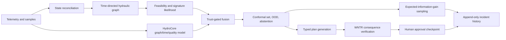

# Architecture

> This page describes the system's architecture generically. For the exact frozen model
> identity, hashes, runtime-enabled outputs, and measured evaluation actually shipped by
> default, see [Final system](FINAL_SYSTEM.md).

HydroSwarm is an offline, event-sourced hybrid inference system. The scientific path is
deliberately separate from the presentation path: the React interface renders typed API
contracts, while WNTR and deterministic constraints remain authoritative.

## Scientific layers

- State reconciliation corrects tank levels, demand multipliers, pump/valve status, and
  reports residual mismatch and uncertainty rather than silently forcing a fit.
- The directed graph is rebuilt from simulated flow at the relevant time. Reversed and
  near-zero edges are explicit.
- The source-signature service caches versioned, checksummed concentration responses and
  falls back to exact simulation on cache mismatch.
- HydroCore combines local edge-aware message passing with global latent attention. Its
  semantic heads predict source, incident timing/rate, sensor health, sample value,
  response actions, consequence residuals, and explanation intents.
- Fusion changes neural trust using disagreement, sensor health, calibration validity,
  and five-component OOD evidence. Invalid calibration or severe OOD suppresses confident
  planning and activates the classical-safe path.
- Scout ranks accessible, non-duplicate samples using expected posterior information
  gain, source separation, detection probability, time, cost, and redundancy.
- Strategist creates diverse bounded plans. HydroVerifier runs exact WNTR/EPANET analysis,
  pressure and service checks, exposure accounting, and explicit rejection/repair.

## Runtime and persistence

FastAPI binds to loopback by default and serves the built frontend and JSON/WebSocket API.
Long operations run through a bounded local worker queue. SQLite stores networks,
incidents, evidence, posterior revisions, plans, jobs, approvals, and a hash-chained event
ledger. On restart, runtime state is reconstructed from durable records. Imported INP
files are size/content/path validated, hashed, deduplicated, and hydraulically checked.

Runtime modes are full hybrid, degraded hybrid, classical safe, and simulation-only.
No mode silently labels a plan verified without a completed WNTR result.

## Security boundaries

The default runtime makes no internet calls, accepts no URLs, runs no input-derived shell
commands, and never writes outside its configured data directory. It is research software,
not an authenticated multi-user service and not an industrial control component.
