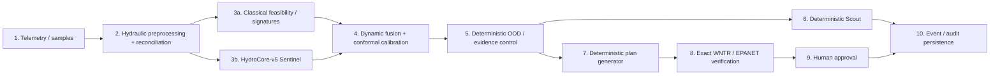

# Architecture

> **Current system:** HydroCore-v5 M10 frozen release. Exact hashes, runtime outputs, and locked status are in [Final system](FINAL_SYSTEM.md). Historical V4 diagrams/reports remain preserved but are not the current architecture authority.

HydroSwarm is an offline, event-sourced hybrid decision-support system. Its central design choice is to separate **predictive advice** from **operational authority**: learned and classical evidence can shape a calibrated source advisory, while deterministic guards decide whether evidence collection or planning may proceed, WNTR/EPANET is required for plan verification, and approval remains a separate human action.

## End-to-end decision path

Source: [diagrams/hydrocore-v5.mmd](diagrams/hydrocore-v5.mmd).

## Decision-authority legend

| Level | Meaning |
|---|---|
| **ADVISORY** | May contribute evidence/predictions; cannot authorize an operational state |
| **CALIBRATED ADVISORY** | Advisory prediction with applicable calibration semantics |
| **DETERMINISTIC** | Rule/algorithmic control that governs whether the workflow may proceed |
| **SIMULATOR_VERIFIED** | Candidate completed exact WNTR/EPANET verification and passed configured constraints |
| **HUMAN_APPROVED** | A human explicitly recorded approval; still no autonomous actuation |

The progression is **ADVISORY → CALIBRATED ADVISORY → DETERMINISTIC → SIMULATOR_VERIFIED → HUMAN_APPROVED**.

## 1. Hydraulic preprocessing and reconciliation

Sensor observations are normalized into typed, causal feature windows with explicit masks and quality state. Hydraulic state is reconstructed against the network model rather than inferred from presentation-layer geometry. Network identity, flow direction, source candidates, timestamps, sensor health, and topology applicability are carried forward as provenance.

The final release records a known feature-semantics deviation: M9.6 training used a fixed unobserved-age sentinel, while the M10.4-tested serving path retained `incident_elapsed` for an unobserved sensor's age feature. This deviation is frozen and documented rather than silently rewritten after evaluation.

## 2. Classical feasibility and signature path

Classical source signatures are simulator-derived concentration responses indexed by governed hydraulic/signature policy. They provide a physics-informed likelihood over candidate sources and remain an independent branch in the hybrid system. The signature cache is checksummed; mismatched identity does not become trusted evidence.

Classical evidence is **ADVISORY**. It does not itself verify a response action.

## 3. Learned Sentinel: HydroCore-v5

HydroCore-v5 is a 4,182,612-parameter graph/time model (`small`). The model architecture contains multiple optional/control heads, but the final trained task family is only `sentinel`.

The only learned outputs enabled at runtime are:

- `source_node`
- `event_presence`
- `event_cause`
- `evidence_sufficiency`
- `relative_strength`

The architecture's `next_step`, learned OOD, learned Scout, learned Strategist, and consequence-control heads are not authoritative runtime controls. See [Model card](MODEL_CARD.md) and the frozen [output governance](../reports/evaluation/hydrocore-v5/m11/m11-2/finalist-freeze.json).

## 4. Fusion and conformal calibration

The classical and neural source beliefs are combined under the frozen fusion configuration (`fuse_source_probabilities-v1`). The resulting advisory can be wrapped in split-conformal calibration (alpha `0.1`, `B_DEPTH_AWARE`) when the frozen artifact is applicable.

Calibration means a marginal coverage property over an applicable population. It is not a per-incident probability that the answer is correct.

## 5. Deterministic OOD and evidence control

`OODDetector` is the operational OOD authority. It evaluates topology/calibration applicability and other evidence conditions; learned OOD output cannot override it.

When calibration is inapplicable or a topology is outside the validated set, the correct outcome can be `CAUTION`/planning suppression. The locked novel-topology population measured exactly this boundary: predictive signal remained, but calibrated/actionable authority was withheld.

## 6. Deterministic Scout

`rank_sample_locations` is the sampling authority. It ranks valid, accessible, non-reselected candidates under bounded sampling policy. A learned `sample_node` or information-gain head is not allowed to select a sample in the final system.

The ranking can consider expected information value, evidence separation, access, delay/cost, and redundancy. The locked safety counter `learned_scout_selected_sample` was zero.

## 7. Deterministic response-plan generation

`generate_response_plans` is the plan-generation authority. Learned Strategist/candidate-conditioned plan heads may exist structurally in the model but are non-authoritative in the final release.

Candidates remain proposals until they undergo exact simulation.

## 8. WNTR / EPANET verification

Plan verification is a hard boundary. HydroSwarm simulates candidate consequences with WNTR/EPANET and evaluates configured hydraulic/service constraints. Timeouts, numerical/incomplete results, or hard-constraint violations cannot be surfaced as verified.

A `VERIFIED` label means the configured simulator checks passed for the modeled network/state. It does **not** mean the plan is proven safe in a real utility.

## 9. Human approval

A verified plan cannot become approved without a distinct human event. Approval is a recorded decision boundary, not a command to infrastructure. The frozen authority manifest explicitly records `autonomous_actuation: false`.

## 10. Persistence and auditability

FastAPI exposes typed local APIs; SQLite stores networks, incidents, observations, analysis revisions, plans, verifications, jobs, approvals, and an append-only/hash-linked audit record. This preserves the difference between what was known, recommended, verified, and approved at each stage.

Replay is evidence review, not recomputation of a more favorable narrative.

## Runtime failure behavior

The V5 bundle loader verifies schema, output/task allowlists, feature/fusion identity, file hashes, checkpoint hash, and calibration identity. Invalid V5 assets fail closed to a non-learned/classical-safe path; there is no silent V4 fallback.

See [Authority and safety](AUTHORITY_AND_SAFETY.md) for the full authority matrix and [Scientific evidence](SCIENTIFIC_EVIDENCE.md) for the locked safety counters.

## Runtime and deployment

The current source app uses `V5PipelineFactory(resolve_v5_bundle_dir())`. The current Dockerfile bakes both historical V4 and final V5 assets but the app chooses V5. For an actual V5 container, build the current checkout; the pinned historical release-compose tag predates the V5 freeze. See [Installation](INSTALLATION.md).

## Security boundary

HydroSwarm is designed as local research software, not an authenticated internet-facing control service. The default application binds locally, makes no hosted-model call, accepts local network files, and has no SCADA/actuation connector. See [Security](SECURITY.md) and [Limitations](LIMITATIONS.md).
