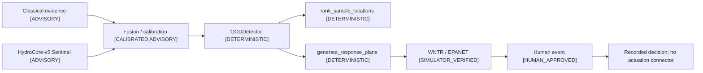

# Authority and safety

HydroSwarm's safety design is an **authority separation** design. Predictive components may inform a decision, but only explicitly authorized deterministic/simulator/human stages may advance the operational state.

## Authority chain

**ADVISORY → CALIBRATED ADVISORY → DETERMINISTIC → SIMULATOR_VERIFIED → HUMAN_APPROVED**

## Subsystem authority matrix

| Subsystem | Learned component present? | Valid trained/runtime role | Operational authority |
|---|---|---|---|
| Source localization | yes | `source_node` advisory | fused/calibrated pipeline subject to deterministic gate |
| Event presence/cause | yes | advisory | none beyond advisory evidence |
| Evidence sufficiency | yes | advisory signal | deterministic workflow rules remain authoritative |
| Relative strength | yes | advisory | none beyond advisory evidence |
| OOD | architecture head exists | learned OOD non-authoritative | `OODDetector` |
| Sampling / Scout | architecture heads exist | learned sampling controls suppressed | `rank_sample_locations` |
| Planning / Strategist | architecture heads exist | learned planning controls suppressed | `generate_response_plans` |
| Consequence proxies | architecture heads exist | not authoritative | exact WNTR/EPANET |
| Verification | no learned authority | n/a | WNTR/EPANET + hard constraints |
| Approval | no learned authority | n/a | human operator |
| Actuation | none | none | no connector / no autonomous actuation |

Source: [M11.2 finalist freeze](../reports/evaluation/hydrocore-v5/m11/m11-2/finalist-freeze.json) and [runtime manifest](../models/hydrocore-v5-release/runtime_manifest.json).

## Why architecture presence is not authority

The V5 configuration contains OOD, Scout, Strategist, event-control, and consequence head structures. The final corpus/governance does not declare all of them as trained operational tasks. The release loader therefore enforces both:

- `trained_tasks = {"sentinel"}`;
- runtime learned-output allowlist = five Sentinel outputs.

This prevents a structurally present but unsupervised/unpromoted head from silently becoming a product claim.

## OOD and calibration boundary

Calibration is allowed only when the frozen artifact is applicable. `OODDetector` is deterministic authority and cannot be overridden by the learned OOD head.

The final novel-topology test proves the behavior:

- predictive Top-1/Top-3 still measurable;
- `calibrated_rate=0`;
- actionable rate `0`;
- approved rate `0`;
- no plan candidates generated;
- topology fail-closed hard gate passed.

The system therefore distinguishes **“the model has a prediction”** from **“the system has calibrated authority to act on it.”**

## Sampling boundary

The final system cannot use a learned Scout head to select the authoritative sample. `rank_sample_locations` enforces deterministic selection over governed candidates/budgets.

M11.6 measured:

- `learned_scout_selected_sample = 0`;
- `inaccessible_sample_selected = 0`;
- `sampled_node_reselected = 0`;
- `sampling_budget_exceeded = 0`.

## Planning boundary

`generate_response_plans` is the final planning authority. Learned Strategist output cannot select the plan that is surfaced as operationally actionable.

M11.6 measured:

- `learned_strategist_selected_plan = 0`;
- `unverified_plan_surfaced_as_actionable = 0`;
- `rejected_plan_surfaced_as_safe = 0`.

## Simulator verification boundary

Every `VERIFIED` operational plan requires completed WNTR/EPANET verification under configured hard constraints. A model consequence proxy cannot replace this stage.

The verifier is still conditional on the modeled network/state. “Simulator verified” is not a synonym for real-world safe.

## Staleness and human approval

A plan is verified against a particular evidence context. If the incident evidence changes, prior verification can become stale and cannot be approved until reverified.

M11.6 records `stale_approval_accepted = 0`.

Human approval is a separate state transition after verification. M11.6 records:

- `human_approval_bypassed = 0`;
- `autonomous_actuation_detected = 0`.

Approval is a recorded decision, not a field command.

## Fail-closed V5 identity

The V5 loader validates release schema, file hashes, checkpoint/calibration identity, feature/fusion identity, trained task allowlist, and runtime output allowlist.

A V5 asset failure makes the trained V5 branch unavailable. The system does not silently load the historical V4 model. M11.6 records:

- `finalist_identity_drift = 0`;
- `silent_v4_fallback = 0`.

## Finite-value / invariant boundary

Non-finite values are rejected before they can become decisions. M11.6 records:

- `nonfinite_value_reached_decision = 0`;
- `invariant_failures = 0`.

## What the locked safety result means

All 15 hard counters were zero across the complete 125-case one-time locked population. The pre-open and post-run runtime-authority checks also passed.

This supports the claim:

> Within the frozen M11.6 synthetic evaluation, no tested hard authority invariant was violated.

It does **not** support:

> HydroSwarm is guaranteed safe for real utility control.

The latter would require field validation, operational integration, cybersecurity validation, real hydraulic-model accuracy, utility procedures, and regulatory/public-health evidence that this project does not provide.

## Review sources

- [Final system](FINAL_SYSTEM.md)
- [M11.6 safety counters](../reports/evaluation/hydrocore-v5/m11/m11-6-final/m11-6-safety-counters.json)
- [M11.6 gate](../reports/evaluation/hydrocore-v5/m11/m11-6-final/m11-6-gate.json)
- [Scientific evidence](SCIENTIFIC_EVIDENCE.md)
- [Limitations](LIMITATIONS.md)
