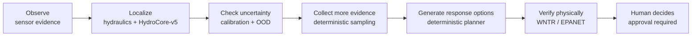

# HydroSwarm Executive Summary

When contamination is suspected in a drinking-water network, operators often have incomplete sensor evidence and several plausible sources at once. HydroSwarm is an offline decision-support system that helps narrow down the likely source, identifies when collecting more evidence would actually help, evaluates candidate response actions with exact hydraulic simulation, and shows candidate response options and their verification results; only current WNTR/EPANET-verified plans can become actionable or approvable. Machine learning contributes evidence to this process, but it is deliberately kept out of final control: a set of deterministic, non-learned rules decides what the system is allowed to act on, and a person still has to approve anything before it counts as a decision. This document explains why that design exists, what the system actually did in its one formal test, and where it still falls short of anything operational.

## 1. Why this problem matters

Picture a routine water-quality sensor reporting an abnormal reading. The utility doesn't know, in that moment, whether it's a sensor fault, a localized event, or something that started upstream and is spreading through the network. Only a handful of sensors are online at any given time, so the picture is always partial. Several different upstream locations could plausibly explain the same reading, because water networks are dynamic: flow direction changes with tank levels, pump schedules, valves, and demand, so a location that looked implausible an hour ago can become the leading suspect now.

Two decisions compound the difficulty. Collecting a confirmatory sample takes real time and effort, so it should only happen when it will meaningfully narrow things down — not just because more data always seems better. And a response action (isolating a zone, flushing a line) is not free of consequences: closing the wrong valve or flushing the wrong segment can drop pressure elsewhere or leave other customers unserved, so an action needs to be checked against the physical network before anyone treats it as safe to consider.

This is hard for structural reasons, not just inconvenient ones. Flow direction and travel time depend on the current operating state; sensor coverage is sparse and sometimes faulty; multiple candidate sources can produce similar signatures; and conditions keep shifting while a response is being worked out. A system that simply outputs "most likely source: node X" with no sense of its own uncertainty is not actually useful here — it's just another opinion with no way to tell when it should be trusted.

That leads to the actual design requirement: **the useful system is not merely the one that predicts a source most often. It must also know when its evidence is insufficient, and it must prevent unsupported recommendations from becoming operational advice.** Everything about HydroSwarm's architecture follows from taking that second half seriously.

## 2. HydroSwarm in one page

HydroSwarm processes one incident through seven stages, each with a distinct kind of authority behind it:

1. **Observe.** Sensor and network evidence — concentration readings, pressures, which sensors are currently online — enters the incident.
2. **Localize.** Classical hydraulic signatures and HydroCore-v5, a learned model, jointly rank plausible contamination source locations. This is advisory evidence, not a verdict.
3. **Check uncertainty.** Statistical calibration and a separate, non-learned out-of-distribution check decide whether the current situation is one the localization step is allowed to speak with confidence about. If it isn't — for example, an unfamiliar network layout — the system says so rather than pretending otherwise.
4. **Collect more evidence when useful.** A deterministic sampling policy (not the learned model) can recommend the next measurement location, based on how much it would be expected to narrow the candidate set.
5. **Generate response options.** A deterministic planner proposes a bounded set of typed response actions — things like isolating a zone or flushing a segment — from the current evidence.
6. **Verify physically.** Every response option that could actually be recommended must pass an exact hydraulic simulation (WNTR/EPANET) confirming its modeled consequences, not just a model's guess at them.
7. **Human decides.** The operator sees the evidence, the ranked candidates, the uncertainty state, and only the physically verified response options — and must explicitly approve one. HydroSwarm does not connect to infrastructure and cannot act on its own.

This loop, not any single model, is the actual product. A learned prediction on its own is step 2 of seven; it does not skip ahead to step 7.

## 3. Why HydroSwarm is designed this way

HydroSwarm is **physics-first and evidence-first**, not **model-first**. That distinction shapes every architectural choice in it.

Machine learning is genuinely useful here: it can pick up on patterns across many interacting signals — sensor readings, timing, network structure — faster and more flexibly than a hand-built rule ever could. But learned predictions degrade under exactly the conditions an incident might actually present: missing sensors, noisy readings, or a network layout the model has never seen. A system that trusted a learned score unconditionally would become least reliable exactly when reliability matters most.

So HydroSwarm treats a learned prediction as one input among several, gated by explicit, non-learned checks:

- Deterministic hydraulic reasoning gives a physically grounded starting point that does not depend on the model having seen anything like this incident before.
- A calibration step controls *when* the model's uncertainty estimate is even statistically meaningful — calibration guarantees are population-level properties that only hold under the conditions they were computed for.
- A separate, non-learned out-of-distribution check can withdraw the learned model's authority entirely, independent of the model's own opinion of itself.
- Response candidates are not accepted because a model scored them highly; they are proposed by a deterministic planner from the current evidence.
- Every response candidate that reaches the operator has already passed exact hydraulic verification — a physics simulation, not a learned consequence estimate.
- A human operator remains the last step, always.

The short version: **HydroSwarm uses machine learning where it adds real predictive evidence, but it does not hand AI final authority just because AI is present in the pipeline.** Prediction and permission-to-act are kept as two different things, decided by two different mechanisms.

## 4. What is actually learned, and what is not

HydroCore-v5 is the locally trained model that supplies the learned evidence in step 2. It is a small model — 4,182,612 parameters — trained specifically for this task, not a general-purpose or hosted language model.

| Capability | What actually performs it | Operational role |
|---|---|---|
| Source / event evidence | HydroCore-v5 Sentinel | Learned, advisory only |
| Calibration / fusion | Frozen calibrated fusion procedure | Controls how much weight learned evidence gets |
| Out-of-distribution check | Deterministic `OODDetector` | Non-learned; can withdraw learned authority |
| Next sample to collect | Deterministic sampling policy | Non-learned |
| Response candidates | Deterministic planner | Non-learned |
| Physical verification | WNTR / EPANET hydraulic simulator | Exact simulation, final physical check |
| Approval | Human operator | Required; final decision |

HydroCore-v5's architecture happens to contain additional head structures — for out-of-distribution classification, sample selection, response-plan scoring — left over from earlier research exploration. None were promoted to operational authority: only five learned outputs actually run at inference time (`source_node`, `event_presence`, `event_cause`, `evidence_sufficiency`, `relative_strength`), enforced as an explicit allowlist rather than trusted implicitly. Concretely, statements like "the model chooses the next sample" or "the neural network picks the response plan" are simply false for this system — those decisions are made by deterministic code. There is no autonomous actuation anywhere in the system: nothing in HydroSwarm can open a valve or command equipment.

More architectural and training detail is in [MODEL_CARD.md](MODEL_CARD.md) and [FINAL_SYSTEM.md](FINAL_SYSTEM.md).

## 5. What the final evaluation showed

How the final test was run is part of the evidence, not just a procedural note. The finalist model was selected and frozen using development data only. A separate population of test incidents was then locked, without HydroSwarm's authors able to see the outcomes in advance, and opening it required an explicit, logged authorization step. Once opened, all 125 test incidents ran exactly once — no rerun, and no tuning after seeing the results. Had the results been mediocre, the correct response under this governance would have been to report that, not to quietly retry. That constraint is what makes the numbers below meaningful rather than a best-of-several-attempts figure.

| Population | Cases | Top-1 | Top-3 | Coverage | Actionable |
|---|---:|---:|---:|---:|---:|
| Nominal (locked) | 15 | 73.3% | 86.7% | 93.3% | 80.0% |
| All locked-final conditions | 105 | 55.2% | 76.2% | 88.6% | 61.0% |
| Novel (unseen) topology | 20 | 55.0% | 70.0% | not applicable | 0.0% |

*Top-1/Top-3: how often the true source was the first or top-three candidate in HydroSwarm's final fused source ranking. Coverage: how often the calibrated candidate set actually contained the true source, under conditions where calibration applies. Actionable: how often the incident produced a response plan the system was willing to treat as operational.*

Alongside these numbers: all 125 planned test incidents completed, none of the 15 tested hard safety invariants (things like "a rejected plan is never surfaced as safe" or "the model never selects its own sample") were violated on any of them, there was exactly one authorized opening of the locked test, and there was no rerun and no post-test tuning.

What the numbers mean, in plain terms:

**Under normal conditions, the model was substantially stronger.** The 15-case nominal slice reached 73.3% Top-1 and 86.7% Top-3 — its best performance.

**Under stress, performance dropped, and that drop is reported rather than hidden.** Across all 105 locked-final incidents — which include measurement noise, sensor dropout, ambiguous or disagreeing signals, and shifting severity, not just easy cases — Top-1 fell to 55.2%. This is a real, measured limitation of the current system, not a rounding difference.

**On completely unfamiliar network layouts, the model retained measurable localization signal — but the system withheld authority anyway.** The 20-incident novel-topology test used network structures the model had never trained on. Top-1 and Top-3 (55.0% / 70.0%) show the model wasn't just guessing randomly. But calibration is only statistically valid under the conditions it was computed for, and an unfamiliar topology falls outside that. So the system's calibration step correctly refused to treat that prediction as trustworthy, and the actionable rate for that entire population was **0.0%** — no response plan on any of those 20 incidents was allowed to reach the point of being treated as operational.

That last result is the point of the whole design, not an embarrassing footnote. **A prediction can contain real information without being reliable enough to control an operational recommendation, and HydroSwarm is built to act on that distinction rather than paper over it.** A system that had instead generated and approved plans from those 20 unfamiliar-topology predictions would have looked more capable on paper and been substantially less trustworthy in practice.

## 6. What makes the result interesting

Setting aside the specific accuracy numbers, several things about how HydroSwarm is built are worth attention on their own:

- It treats **refusing to act** as a legitimate, correctly-functioning output — not a bug or a missing feature. Zero actionable recommendations on the novel-topology test is the system working as intended.
- It keeps **prediction and operational authority structurally separate**, so a confident-looking model score cannot, by itself, unlock a response recommendation.
- Deterministic and learned components can **disagree**, and the deterministic side does not automatically defer to the learned one.
- Every response candidate that could reach an operator has already passed **exact physical simulation**, not a learned proxy for one.
- **Human approval is a required, separately recorded step**, not a formality layered on top of an otherwise-automatic decision.
- The final evaluation was **locked and opened exactly once**, with governance that would have surfaced a bad result rather than allowing a quiet retry.
- The topology-shift test is a clean demonstration of the difference between "the model produced a prediction" and "the prediction is safe enough to operationalize" — a distinction many systems don't measure explicitly, let alone enforce.

These are offered as system-design characteristics worth scrutinizing, not as claims that the underlying research ideas are unprecedented.

## 7. What HydroSwarm does NOT establish

This is deliberately as prominent as the results above.

- All evaluation data — training, development, and the final locked test — is synthetic, generated from hydraulic simulation, not real utility incidents.
- HydroSwarm has not been validated against a real utility incident of any kind.
- The reported numbers are measured synthetic performance, not field-deployment accuracy, and should not be read as a forecast of either.
- Real utility networks may be larger, older, and messier than the synthetic topologies used here, with different sensor placement and data availability.
- Calibration validity does not automatically transfer to a network topology the calibration procedure never saw — the novel-topology result in Section 5 is exactly this limitation, demonstrated rather than assumed.
- Hydraulic verification is only as accurate as the network model supplied to it; a wrong or outdated network model produces a confidently wrong verification.
- HydroSwarm does not determine contaminant chemistry, toxicity, or pathogen risk — its scope is source localization and response comparison, not water-quality science.
- HydroSwarm does not operate valves, pumps, or any other infrastructure, and has no connector that would let it do so.
- It does not replace the judgment of utility engineers or emergency decision-makers; it is intended to inform that judgment, not stand in for it.

The concrete next step toward any operational claim is real network and utility data, together with controlled field or utility-partner validation. Nothing in the current evidence substitutes for that.

## 8. What feedback would be most useful from an expert

HydroSwarm is looking for critical review, not endorsement. If you have relevant expertise, the most useful things to tell us are:

1. Are the assumed contamination and localization scenarios hydraulically realistic?
2. Does the source-localization formulation leave out an important practical constraint?
3. Is the sensor/sampling workflow representative of how evidence could actually be collected in the field?
4. Are the boundaries between deterministic and learned authority drawn in the right places?
5. Is the novel-topology result (Section 5) being interpreted correctly, or is there a more critical reading of it?
6. Are there operational failure modes this design misses entirely?
7. Does the interface expose the evidence a water-system operator or analyst would actually need to trust or challenge a recommendation?
8. What evidence would you need to see before considering a utility pilot at all?
9. Which parts of this project look scientifically misleading, overstated, or over-engineered relative to what's actually demonstrated?
10. What would you remove, change, or independently validate next?

## 9. Where to go deeper

This summary is meant to stand on its own. If you want more depth on a specific area:

- Architecture: [ARCHITECTURE.md](ARCHITECTURE.md)
- Exact final system identity: [FINAL_SYSTEM.md](FINAL_SYSTEM.md)
- Model details: [MODEL_CARD.md](MODEL_CARD.md)
- Full scientific evaluation: [SCIENTIFIC_EVIDENCE.md](SCIENTIFIC_EVIDENCE.md)
- Evaluation protocol and governance: [EVALUATION.md](EVALUATION.md)
- Authority and safety design: [AUTHORITY_AND_SAFETY.md](AUTHORITY_AND_SAFETY.md)
- Data sources and governance: [DATASET_CARD.md](DATASET_CARD.md)
- Reproducing the evidence: [REPRODUCIBILITY.md](REPRODUCIBILITY.md)
- Known limitations in full: [LIMITATIONS.md](LIMITATIONS.md)
- Claim-by-claim evidence audit: [CLAIMS_AND_EVIDENCE.md](CLAIMS_AND_EVIDENCE.md)
