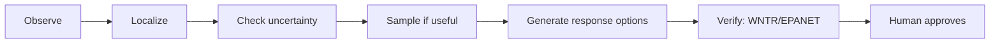

# HydroSwarm Executive Summary

## 1. The problem

When a water utility gets an abnormal sensor reading, it rarely knows what caused it. Sensor coverage is sparse, so the picture is always partial, and several different upstream locations can plausibly explain the same reading. Flow direction and travel time shift with tank levels, pump schedules, and demand, so the leading suspect can change hour to hour. Two costs make this harder to resolve quickly. Collecting a confirmatory sample takes real time and effort, so it should only happen when it will meaningfully narrow the field. And a response action (isolating a zone, flushing a line) has hydraulic and service consequences of its own: closing the wrong valve can drop pressure or cut off other customers, so no response should be treated as operationally eligible until it has been checked against the modeled physical network.

This sets the central design requirement: the system must not only rank likely sources, it must also know when its evidence is insufficient to support an operational recommendation, and it must prevent unsupported predictions from becoming operational advice.

For the research basis behind this problem framing, and a breakdown of what impact is measured versus merely plausible, see [Problem and product boundary](PROBLEM.md).

## 2. What HydroSwarm does

HydroSwarm processes an incident through a fixed sequence, with a distinct kind of authority behind each stage:

**Observe.** Sensor readings, pressures, and which sensors are currently online enter the incident. **Localize.** Classical hydraulic signatures and HydroCore-v5, a small learned model, jointly rank plausible source locations; this is advisory evidence, not a verdict. **Check uncertainty.** A calibration step and a separate non-learned out-of-distribution check decide whether the current situation is one the localization step is allowed to determine whether calibrated candidate-set semantics apply and whether the workflow may proceed operationally; on an unfamiliar network layout, the system says so rather than pretending otherwise. **Sample if useful.** A deterministic sampling policy, not the learned model, can recommend the next measurement location. **Generate response options.** A deterministic planner proposes a bounded set of typed actions. **Verify.** Every option that could be recommended must pass exact hydraulic simulation in WNTR/EPANET, the system's final physical authority. **Human approves.** The operator sees the evidence, the ranking, the uncertainty state, and only the physically verified options, and must explicitly approve one. HydroSwarm has no connector to infrastructure and cannot act on its own.

HydroCore-v5 contributes learned evidence at exactly one stage. Every other stage (calibration/fusion, OOD gating, sampling, planning, verification) is deterministic or physics-based, and approval is always human.

## 3. Why the authority split matters

Machine learning is genuinely useful here: it can pick up on patterns across many interacting signals faster than a hand-built rule. But learned predictions degrade under exactly the conditions an incident might present: missing sensors, noisy readings, or a network layout the model has never seen. A system that trusted a learned score unconditionally would be least reliable exactly when reliability matters most. So HydroSwarm treats a learned prediction as one input, gated by non-learned checks that can withdraw its authority independent of the model's own confidence.

| Function | Authority |
|---|---|
| Source / event evidence | HydroCore-v5 + classical evidence |
| Calibration / fusion | Frozen calibrated procedure |
| OOD / permission to rely on learned evidence | Deterministic |
| Sampling | Deterministic |
| Response generation | Deterministic |
| Physical verification | WNTR / EPANET |
| Final decision | Human |

Prediction and permission-to-act are kept as two different things, decided by two different mechanisms. One consequence, demonstrated directly in Section 4, is that refusing to act can itself be the correct output: a prediction can carry real information without being sufficiently governed or calibrated to support a recommendation. More architectural and training detail (parameter count, dormant head structures, the exact runtime-output allowlist) is in [MODEL_CARD.md](MODEL_CARD.md) and [FINAL_SYSTEM.md](FINAL_SYSTEM.md).

## 4. What the final evaluation showed

The finalist model was selected and frozen using development data only. Two locked populations were then established: 105 locked-final incidents, and a separately locked 20-incident novel-topology set. Opening either required an explicit, logged authorization step. Once opened, every incident ran exactly once: no rerun, and no tuning after seeing results. Each locked population was opened exactly once.

| Population | Cases | Top-1 | Top-3 | Coverage | Actionable |
|---|---:|---:|---:|---:|---:|
| Nominal (locked) | 15 | 73.3% | 86.7% | 93.3% | 80.0% |
| All locked-final conditions | 105 | 55.2% | 76.2% | 88.6% | 61.0% |
| Novel topology | 20 | 55.0% | 70.0% | N/A | 0.0% |

*Top-1/Top-3: how often the true source was the first / top-three candidate. Coverage: how often the calibrated candidate set contained the true source, where calibration applies. Actionable: how often the incident produced a response plan the system was willing to treat as operational.*

None of the 15 tested hard safety counters (e.g., "rejected or unverified plans do not cross the configured authority boundary.") were violated across any of the 125 incidents.

Three points of interpretation, no more:

1. Nominal performance was substantially stronger than the stressed or shifted populations.
2. Performance degraded under stress (measurement noise, sensor dropout, ambiguous signals, shifting severity), and that degradation is reported rather than hidden. This does not mean planning was suppressed across every degraded condition; several stressed conditions still produced actionable plans (see [SCIENTIFIC_EVIDENCE.md](SCIENTIFIC_EVIDENCE.md) for the per-condition breakdown).
3. On genuine topology shift, localization retained measurable signal (55% Top-1 / 70% Top-3), but calibration was inapplicable and operational authority was withheld entirely: 0% actionable across all 20 incidents. This is not weak generalization being spun positively; it is the governance behaving as designed when calibration cannot be trusted.

## 5. What this establishes, and what it does not

- All evaluation data (training, development, and the final locked test) is simulation-generated, not drawn from real utility incidents.
- HydroSwarm has not been validated against a real utility incident of any kind.
- Reported metrics are synthetic performance, not field-deployment accuracy, and should not be read as a forecast of either.
- Performance under stress and under genuine topology shift remains limited, as shown above.
- Hydraulic verification is only as accurate as the network model supplied to it; a wrong or outdated model produces a confidently wrong verification.
- HydroSwarm does not determine contaminant chemistry, toxicity, or pathogen risk; its scope is source localization and response comparison.
- HydroSwarm cannot operate valves or pumps, has no actuation connector, and does not replace the judgment of utility engineers or emergency decision-makers.

The next meaningful validation step is evaluation against real utility network and incident data, through controlled utility-partner validation.

## 6. Where to go deeper

- Full scientific evaluation: [SCIENTIFIC_EVIDENCE.md](SCIENTIFIC_EVIDENCE.md)
- Model details: [MODEL_CARD.md](MODEL_CARD.md)
- Exact final system identity: [FINAL_SYSTEM.md](FINAL_SYSTEM.md)
- Authority and safety design: [AUTHORITY_AND_SAFETY.md](AUTHORITY_AND_SAFETY.md)
- Reproducing the evidence: [REPRODUCIBILITY.md](REPRODUCIBILITY.md)
