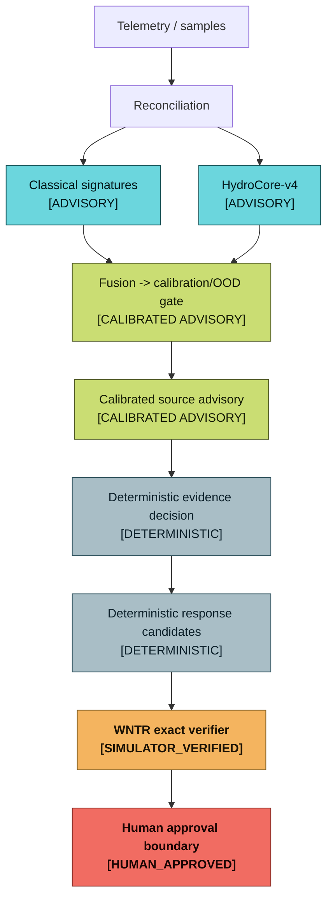
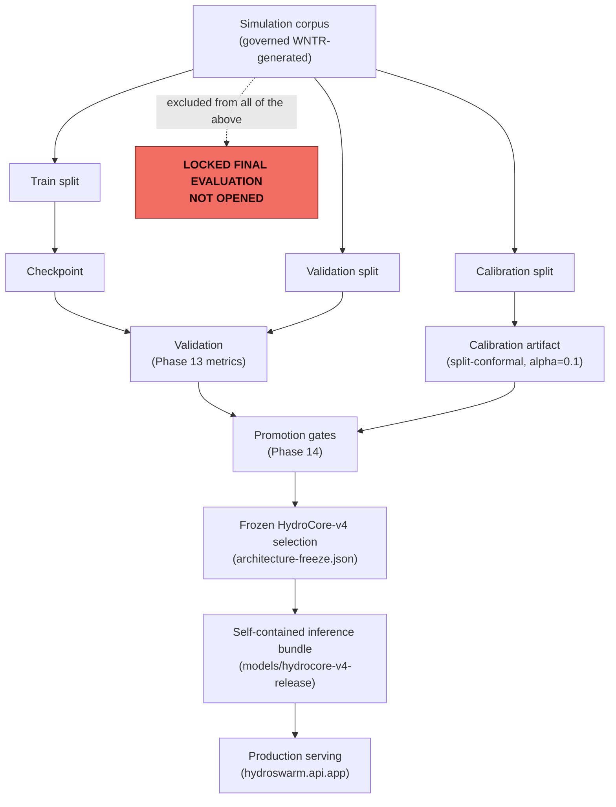

# Final system authority

This is the one canonical page for "what actually ships." If any other document,
diagram, or demo narrative in this repository appears to disagree with this page, this
page is authoritative -- report the discrepancy rather than trusting the other document.

## Frozen architecture identity

| Field | Value |
|---|---|
| Architecture | `hydrocore-v4` (`small` variant) |
| Parameters | 4,182,612 (4.18M) |
| Checkpoint size | 16.7 MB (`model.safetensors`) |
| Model SHA-256 | `a501ad87bc39943c48c1a0ea5fc9b6d0807491b684b4423542acbdba712d16c7` |
| Normalization hash | `e0808f21579b693f66e4edb5900e561bcf9c521e850d5c9d2428cb0db0fa1114` |
| Feature schema hash | `7ec97775e5f01f87ae62669146a7eb70958f99b1162a356614eb87220e9ddd09` |
| Signature policy hash | `06e31d922261509c3aaae558262d3b5748b42a3a7bb26c4218a6e56acb686811` |
| Calibration status | `FITTED`, alpha=0.1, held-out coverage 91.4% |
| Freeze declaration | [architecture-freeze-declaration.md](../reports/results/v4/architecture-freeze-declaration.md) |
| Freeze manifest | [architecture-freeze.json](../reports/results/v4/architecture-freeze.json) |

(Source: [docs/diagrams/authority-architecture.mmd](diagrams/authority-architecture.mmd).)

This is the exact identity `hydroswarm self-test` and `hydroswarm.api.app:app` resolve to
by default (source checkout, native install, or the published Docker image). Any
divergence between what a running instance reports and the hashes above is a real defect,
not a formatting difference -- see [Installation](INSTALLATION.md) for how to verify it
yourself (`hydroswarm self-test` prints `trained_assets.model_sha256`).

## What is and is not runtime-enabled

HydroCore-v4 trains 21 output heads. Only 6 are runtime-enabled (serve real, governed
predictions the console and API surface to an operator); the rest are trained-and-measured
but not promoted, or excluded outright with a documented reason. This distinction matters:
a trained head that is not runtime-enabled must never be presented as an operational
prediction.

| Runtime-enabled (serves predictions) | Trained, not runtime-enabled | Excluded (documented reason) |
|---|---|---|
| `source_node` | `candidate_reduction`, `containment_time_proxy`, `duration`, `exposure_proxy`, `information_gain`, `plan_regret_proxy`, `plan_validity`, `plan_value`, `pressure_risk_proxy`, `sample_node`, `sensor_fault`, `service_loss_proxy`, `should_continue_sampling`, `source_region`, `start_time` | `ood_category` -- near-chance macro F1 (~1/11), zero real train-split gradient (Phase 13 finding) |
| `event_presence` | | `sensor_reconstruction`, `travel_time` -- never physically constructed for this config (`auxiliary_heads=False`) |
| `event_cause` | | |
| `evidence_sufficiency` | | |
| `next_step` | | |
| `relative_strength` | | |

Full governance detail: [output_governance.json](../models/hydrocore-v4-release/output_governance.json).

## Measured evaluation (held-out validation split)

| Metric | Value |
|---|---:|
| Source localization top-1 | 72.1–73.3% |
| Source top-3 / candidate-set coverage@3 | 86.8–87.6% |
| Mean reciprocal rank | 0.811–0.817 |
| Conformal candidate-set coverage (calibrated) | 91.4% |
| Event-presence detection F1 | 0.895 |
| Event-cause macro F1 (3 supported classes) | 0.698 |

Full detail, per-class breakdowns, and two evaluation caveats the report surfaces up
front (not hidden): [Phase 13 metrics and baselines](../reports/results/v4/phase13-metrics-and-baselines.md).

**Locked final evaluation status:** `locked_test_opened: false`,
`locked_evaluation_status: NOT PERFORMED -- awaiting separate explicit authorization`
(from the freeze manifest above). No number on this page or anywhere else in this
repository is drawn from the locked final evaluation.

(Source: [docs/diagrams/model-lifecycle.mmd](diagrams/model-lifecycle.mmd).)

## Authority boundaries (never weakened)

- **No `VERIFIED` status without a completed exact WNTR/EPANET simulation.** A neural
  estimate alone never promotes a plan.
- **No plan executes without a separate human approval event.** The controller has a
  dedicated approval pause; approval and execution are never the same event, and
  execution here means "recorded as approved," not any infrastructure action.
- **Stale verification blocks approval.** If the incident's evidence context changes
  after a plan was verified, that verification is marked `STALE` and cannot be approved.
- **Calibration invalidity suppresses planning**, not just a warning label -- an
  unvalidated calibration artifact or unknown network topology produces `CAUTION` and
  blocks the planning stage.
- **Deterministic OOD/sampling/planning authority is never bypassed** by a demo,
  reference, or fallback experience state -- see [Experience states](#experience-states)
  below for how each mode is kept honestly distinct instead.

## Experience states

The console has five distinct provenance modes; a screen can never be mistaken for
another one (submission.txt SS4/SS6):

| Mode | Meaning | Label |
|---|---|---|
| `LIVE` | Real backend, real current incident, real WNTR verification | `LIVE` |
| `REFERENCE` | Deterministic, checksummed replay of the frozen golden scenario -- the primary judge demo | `REFERENCE INCIDENT · VERIFIED REPLAY` |
| `DEMO_FALLBACK` | Hand-authored illustrative content, backend unavailable -- last resort | `ILLUSTRATIVE DEMO / DEMO_FALLBACK` |
| `ERROR` | State cannot be safely rendered -- fails closed, no operational recommendations | `INCIDENT UNAVAILABLE` |
| Replay (workspace, not a source mode) | Inspects a completed LIVE or REFERENCE incident's real hash-chained event ledger | (contextual) |

## Runtime paths

- **Docker (recommended judge path):** `docker compose -f docker-compose.release.yml up`
  -- pulls the published multiarch (`linux/amd64`, `linux/arm64`) image, no local build.
- **Native:** `./setup_hydroswarm_linux.sh` / `_macos.sh` / `_windows.ps1`, then the
  matching `start_hydroswarm_*` launcher. See [Installation](INSTALLATION.md).
- Both paths resolve the frozen bundle through the same
  `hydroswarm.runtime.paths.resolve_v4_bundle_dir` function `hydroswarm.api.app` and
  `hydroswarm self-test` both call -- they cannot silently disagree about which bundle is
  being served.

## Source of truth for this page

This page is written by hand but every number and hash on it was copied from a real,
generated artifact (linked inline above), not typed from memory. If you regenerate the
frozen bundle or re-run Phase 13, update this page's numbers to match the new output
before publishing -- do not leave it stale relative to a new frozen identity.
