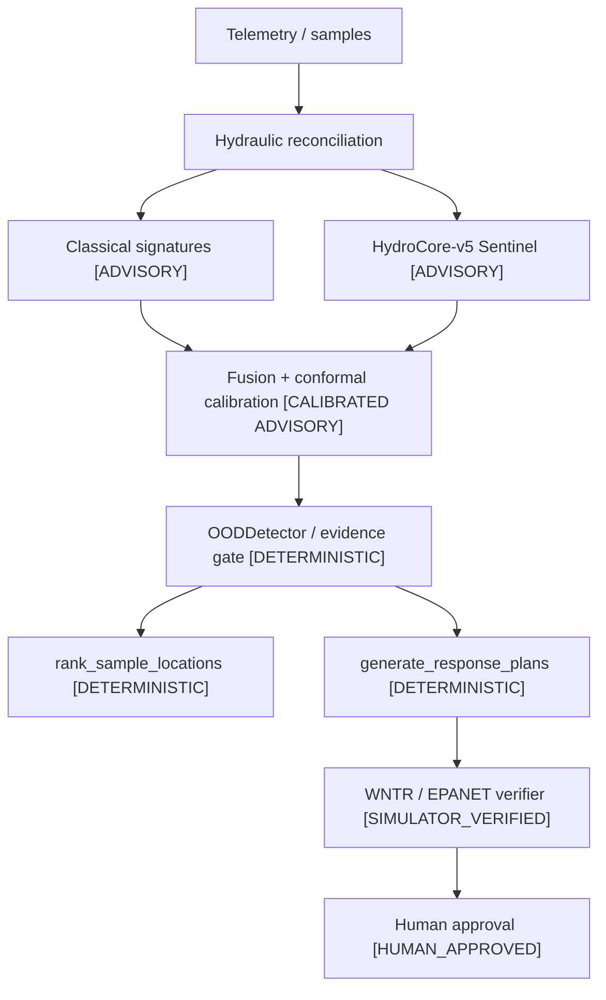

# Final system authority

> **Current authority.** This page defines the final HydroSwarm system. Generated frozen artifacts are the factual source of truth; if another current document disagrees with this page, treat that discrepancy as a documentation defect. Historical V3/V4/M9/M10 reports remain valid records of their own experiments but do not override the final V5 freeze.

## Frozen finalist identity

| Field | Frozen value |
|---|---|
| Finalist | `HydroCore-v5 M10 frozen release` |
| Variant | `small` |
| Parameters | 4,182,612 |
| Selected seed | `20260814` |
| Checkpoint | `models/hydrocore-v5-release/model.safetensors` |
| Checkpoint SHA-256 | `de2b3f56243a1933d1d7c5957cd74a29fade119f7d104ce7f1500b3dd7b6d2a5` |
| Release manifest | `models/hydrocore-v5-release/runtime_manifest.json` |
| Release manifest SHA-256 | `f3fb08642738128f020c50e20e6b68c417bf80703f7ef6bc8f42db2aa41f8d34` |
| Feature schema fingerprint | `7ec97775e5f01f87ae62669146a7eb70958f99b1162a356614eb87220e9ddd09` |
| Fusion configuration | `fuse_source_probabilities-v1` |
| Calibration file SHA-256 | `8f77f06b72316455e1f8040dbeb5907503e4eb623dd527d9ea809a56e96c046d` |
| Calibration artifact hash | `f2503e856c467eb38c6c7f6dbde679527c1921925941ec52809bd6e8e6dd16dd` |
| Calibration policy | alpha `0.1`, `B_DEPTH_AWARE` |
| Serving identity | `V5PipelineFactory(resolve_v5_bundle_dir())` |
| V4 fallback | none |

Primary frozen records: [M11.2 finalist freeze](../reports/evaluation/hydrocore-v5/m11/m11-2/finalist-freeze.json), [V5 runtime manifest](../models/hydrocore-v5-release/runtime_manifest.json), and [M10.5 completion closure](../reports/evaluation/hydrocore-v5/m10/m10-5-completion/m10-5-completion-closure.json).

## Training recipe and selected checkpoint

The finalist is the 4.18M-parameter S-scale model selected after the governed M9 search. The frozen recipe is:

1. `CLASSICAL_HYDROCORE_S`
2. `AGE_FIX_ONLY`
3. `EXACT_1350_STEP_INTERLEAVED_MULTI_TOPOLOGY_TRAINING`

The selected seed is `20260814`. Its canonical checkpoint is the **final optimizer step 1350**, not the best-validation checkpoint. Training interleaved `golden-reference`, `branched-loop`, and `loop-grid` with equal family weighting and 200 physical training scenarios per family. See the [selected M9.6 training record](../reports/evaluation/hydrocore-v5/m9-6/m9-6-training-runs/ARM_B_M9_6-seed20260814.json) and [M9 final closure](../reports/evaluation/hydrocore-v5/m9-final/m9-final-summary.md).

A known feature-semantics caveat is frozen rather than hidden: the M9.6 training record used a fixed sentinel for unobserved measurement age, while the M10.4-tested serving path retained the runtime `incident_elapsed` behavior. The finalist freeze records this train/serve semantic deviation explicitly. It was not modified after the locked evaluation.

## What is and is not runtime-enabled

The model architecture contains optional specialist/control heads, but architecture presence is not the same thing as valid supervision, runtime promotion, or operational authority. This section deliberately separates **architecture heads**, **validly supervised/trained tasks**, **runtime-enabled learned outputs**, and **operational authority**.

| Layer | Frozen status |
|---|---|
| Model architecture | Includes event-control, OOD-category, Scout-control, candidate-conditioned Strategist, and consequence-prescreening head structures |
| Valid trained task family | `sentinel` only |
| Learned runtime outputs | `source_node`, `event_presence`, `event_cause`, `evidence_sufficiency`, `relative_strength` |
| Suppressed / untrained operational outputs | `next_step`, learned OOD, `sample_node`, information-gain/candidate-reduction controls, sampling-stop control, learned plan validity/value/consequence/regret outputs |
| Deterministic OOD authority | `OODDetector` |
| Deterministic sampling authority | `rank_sample_locations` |
| Deterministic planning authority | `generate_response_plans` |
| Physical verification authority | WNTR / EPANET |
| Approval authority | Human operator |
| Autonomous actuation | `false` |

`V5PipelineFactory` enforces the five-output allowlist and `sentinel` task allowlist while loading the frozen bundle. If the V5 bundle is missing, malformed, or hash-inconsistent, the learned branch fails closed; it does not silently select V4.

## Decision authority chain

Current diagram source: [hydrocore-v5.mmd](diagrams/hydrocore-v5.mmd). See [Authority and safety](AUTHORITY_AND_SAFETY.md) for the subsystem-by-subsystem matrix.

### Authority legend

**ADVISORY → CALIBRATED ADVISORY → DETERMINISTIC → SIMULATOR_VERIFIED → HUMAN_APPROVED**

A learned estimate can influence an advisory posterior, but it cannot select an authoritative sample by itself, bypass OOD control, generate an actionable verified plan by itself, approve anything, or actuate infrastructure.

## Calibration and applicability

The frozen split-conformal artifact uses alpha `0.1` with `B_DEPTH_AWARE` grouping. The release manifest binds calibration to the checkpoint, feature schema, and fusion identity and lists three validated topology hashes.

Calibration coverage is a **marginal population property**, not a per-incident confidence guarantee. If the current topology/calibration group is inapplicable, the correct behavior is to withhold calibrated authority. This is exactly what occurred in the locked novel-topology population: `calibrated_rate = 0`, `actionable_rate = 0`, and the fail-closed topology gate passed.

## M11.6 one-time locked evaluation

The final test is no longer unopened. It was opened exactly once after the finalist was frozen, the locked design/population was materialized, M11.5 was green, and explicit authorization was consumed.

| Governance / terminal fact | Result |
|---|---|
| Locked-final population | 105 incidents |
| Locked-topology population | 20 incidents |
| Population complete | 125/125 |
| Authorized openings | 1 |
| Actual open count | 1 |
| Authorization consumed | yes |
| Locked rerun | no |
| Post-lock tuning | no |
| Final gate | `M11_6_LOCKED_FINAL_PASS` |
| Topology gate | `M11_6_LOCKED_TOPOLOGY_PASS` |
| Overall state | `M11_6_LOCKED_EVALUATION_PASS` |
| Hard safety counters | 15/15 evaluated, all zero |

Immutable terminal records: [opened record](../reports/evaluation/hydrocore-v5/m11/m11-6-final/m11-6-opened-record.json), [post-run governance](../reports/evaluation/hydrocore-v5/m11/m11-6-final/m11-6-post-run-governance.json), [gate](../reports/evaluation/hydrocore-v5/m11/m11-6-final/m11-6-gate.json), [metrics](../reports/evaluation/hydrocore-v5/m11/m11-6-final/m11-6-metrics.json), [safety counters](../reports/evaluation/hydrocore-v5/m11/m11-6-final/m11-6-safety-counters.json), and [closure](../reports/evaluation/hydrocore-v5/m11/m11-6-final/m11-6-closure.json).

### Locked predictive results

| Population | n | Top-1 | Top-3 | MRR | Coverage | Actionable |
|---|---:|---:|---:|---:|---:|---:|
| Nominal locked-final | 15 | 73.3% | 86.7% | 0.821 | 93.3% | 80.0% |
| All locked-final | 105 | 55.2% | 76.2% | 0.687 | 88.6% | 61.0% |
| Novel topology | 20 | 55.0% | 70.0% | 0.652 | not calibration-applicable | 0.0% |

The novel-topology predictive metrics are explicitly `DESCRIPTIVE_NON_GATING`. Their role is to characterize retained signal under genuine topology shift. The operational result is the fail-closed behavior: no calibrated applicability, no actionable planning, and no human-approved plan.

The locked gate did enforce the final calibration-coverage floor (`>= 0.85`) on the applicable locked-final population, plus population completeness, finalist identity, manifest hashes, finite outputs, topology novelty/fail-closed behavior, sample budget, no unsafe action, no V4 fallback, and zero safety counters.

For the complete per-condition matrix and gating/descriptive distinction, see [Scientific evidence](SCIENTIFIC_EVIDENCE.md).

## Safety boundaries

- No `VERIFIED` plan without completed exact WNTR/EPANET verification.
- No approval without a separate human approval event.
- Evidence changes invalidate prior verification context; stale verification cannot be approved.
- Calibration/OOD inapplicability can suppress planning.
- Learned OOD, Scout, and Strategist outputs do not replace deterministic authority.
- No autonomous actuation connector exists.
- Fail-closed behavior is measured evidence about the software authority boundary, **not** proof that a real utility action is safe.

## Deployment identity

The current source application default is V5. `hydroswarm.api.app:app` constructs `V5PipelineFactory(resolve_v5_bundle_dir())`, and the current strict self-test loads the same V5 bundle.

For current V5 Docker behavior, build the current checkout (`docker compose build && docker compose up`). `docker-compose.release.yml` remains pinned to the historical `v0.1.0-hackathon` image, whose Dockerfile predates V5; therefore it is not a V5 release path. The native setup helper also contains a legacy redundant V4 precheck before the final V5 strict self-test. These are packaging/readiness follow-ups, not changes to the frozen finalist.

See [Installation](INSTALLATION.md).

## What this evidence does not establish

- No live utility or field validation has been performed.
- Synthetic generalization is not field accuracy.
- Aggregate locked performance degrades materially relative to nominal conditions.
- Novel-topology predictive metrics do not carry calibration or action authority.
- WNTR/EPANET verification is conditional on network/model assumptions; it is not real-world safety certification.
- The model does not identify contaminant chemistry, toxicity, pathogen viability, or regulatory status.
- Human approval does not turn the software into an actuation system.

See [Limitations](LIMITATIONS.md) and [Model card](MODEL_CARD.md).

## Historical generations

HydroCore-v4 and earlier S/M/L artifacts remain preserved for research provenance. Their metrics and old lock status are historical statements about those generations. Do not use them as current V5 evidence; use [Evaluation](EVALUATION.md#historical-record) for the historical map.
