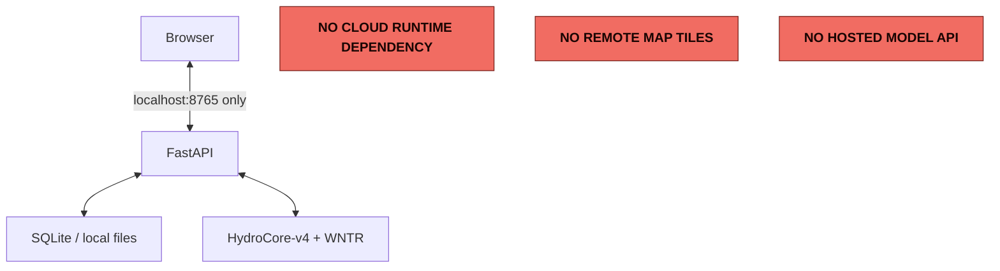

# Installation and offline launch



(Source: [docs/diagrams/offline-deployment.mmd](diagrams/offline-deployment.mmd).)

## Requirements

- Python 3.12 (64-bit)
- Node.js 22 only when rebuilding the frontend
- Approximately 4 GiB RAM for the small/default demonstration; more for large models
- WNTR's EPANET runtime, installed as a Python dependency

## Native install (recommended: platform setup script)

The setup scripts create a project-local `.venv`, install CPU-only dependencies into it
(never globally, never via `sudo`/system package managers), verify the frozen
HydroCore-v4 release bundle, build the frontend if no prebuilt `frontend/dist` exists,
and run the readiness self-test. They are safe to re-run.

```bash
git clone https://github.com/insightlabs38-pixel/HydroSwarm.git
cd HydroSwarm

./setup_hydroswarm_linux.sh   # Linux (x86-64 or ARM64)
./setup_hydroswarm_macos.sh   # macOS (Apple Silicon or Intel)
```

```powershell
.\setup_hydroswarm_windows.ps1   # Windows (PowerShell)
```

Then launch with the matching platform launcher -- each fails closed (rather than
silently falling back to an ambient system Python) if `.venv` does not exist, and each
runs a readiness check before binding to loopback:

```bash
./start_hydroswarm_linux.sh
./start_hydroswarm_macos.sh
```

```powershell
.\start_hydroswarm_windows.ps1
```

`start_hydroswarm.sh` / `start_hydroswarm.bat` remain as thin compatibility wrappers
that delegate to the platform-specific launcher above.

The app opens at `http://127.0.0.1:8765`. Dependency downloads are required only during
installation; runtime operation is offline.

## Manual native install

The setup scripts above are equivalent to, and preferred over, the manual steps:

```powershell
git clone https://github.com/insightlabs38-pixel/HydroSwarm.git
cd HydroSwarm
python -m venv .venv
.venv\Scripts\python -m pip install --upgrade pip
.venv\Scripts\python -m pip install -e "."
cd frontend
npm.cmd ci
npm.cmd run build
cd ..
.venv\Scripts\hydroswarm self-test
.\start_hydroswarm.bat
```

Linux/macOS equivalents use `.venv/bin/python`, `npm ci && npm run build`, and
`./start_hydroswarm.sh`.

## Container

**Judge/release path (recommended, no build required):** pulls the published multiarch
(amd64 + arm64) image from GHCR.

```text
docker compose -f docker-compose.release.yml up
```

**Developer path (builds from source):**

```text
docker compose build
docker compose up
```

Both compose files publish only `127.0.0.1:8765`, remove Linux capabilities, prevent
privilege escalation, use a read-only root filesystem, and persist application state in
the `hydroswarm-data` volume. The release image is built and pushed by
`.github/workflows/release.yml` on a version tag (`v*`); see `RELEASE_MANIFEST.json` in
each release for the exact model/calibration/normalization hashes and container digest
that image was built from.

## Performance: native Windows vs. Linux/Docker

HydroSwarm's optimized, production-equivalent runtime target is **Linux**
(Docker, amd64/arm64) -- see [Container](#container) above. Native Windows is a
fully supported, correct install path, but it has materially higher latency for
exact hydraulic/water-quality simulation specifically, for a real, unavoidable
platform reason:

HydroSwarm's simulator wrapper runs every real WNTR/EPANET call in a genuine,
killable OS subprocess with a hard wall-clock timeout (not a daemon thread, which
Python cannot forcibly stop). On Linux/macOS this uses `multiprocessing`'s `"fork"`
start method -- a near-instant, sub-millisecond way to hand a live incident
analysis off to a child process. Windows has no `fork()` syscall at all, so the
same code correctly falls back to `"spawn"` there -- the only start method Windows
supports -- which starts a brand-new Python interpreter and re-imports NumPy,
pandas, WNTR, and Torch for every single exact simulation call. That is a real,
multi-second-per-call cost on native Windows that does not exist on Linux/macOS.

This does not affect correctness, but it does mean HydroSwarm's Windows CI matrix
leg does not run every real-simulator test the way Ubuntu does:

- **Linux/Ubuntu CI runs the complete, authoritative scientific/backend test
  suite** -- every real WNTR/EPANET test, with coverage. This is the correctness
  reference.
- **Native Windows CI runs a broad cross-platform backend suite (audited to make
  zero real simulator calls) plus a small, dedicated real-simulator compatibility
  suite** proving native WNTR/EPANET execution, timeout/termination, exception
  propagation, and one exact plan-verification and end-to-end incident workflow
  through the real Windows `"spawn"` path -- once, not hundreds of times. A
  runtime audit (`tests/conftest.py`) independently fails Windows CI if any test
  outside that dedicated suite is ever found making a real simulator call, so
  this split is enforced, not merely documented.

**If you are running HydroSwarm natively on Windows and need production-equivalent
exact-simulation latency and test coverage, use Docker Desktop (WSL2 backend) and
the Container path above instead of the native PowerShell install** -- that runs
the real Linux container image, restoring the `"fork"` path. Do not expect native
Windows performance parity, or an equally exhaustive real-simulator test pass, to
Linux for workloads that make many exact simulator calls (e.g. bulk plan
comparison, corpus generation, training); native Windows remains appropriate for a
demo/self-test/light interactive session.

## Reproducibility checks

```powershell
hydroswarm self-test
python -m pytest --cov=hydroswarm --cov-branch
python -m ruff check src tests
python -m pyright
python -m build --wheel --no-isolation
cd frontend
npm.cmd run lint
npm.cmd run test -- --run
npm.cmd run build
```

`self-test` executes real model inference and a bounded WNTR simulation, checks SQLite,
resource availability, bind-port status, dependency versions, and frontend assets, and
emits machine-readable hashes. A failure exits nonzero.

## Troubleshooting

- If port 8765 is occupied, pass `--port` to `hydroswarm start`.
- If memory is constrained, use a small checkpoint or classical-safe mode.
- A missing frontend build does not invalidate scientific APIs, but self-test reports
  `source-only`; run the frontend build before a demo.
- Delete no incident database to “fix” a migration. Preserve it and inspect the startup
  error; production-like evidence must remain recoverable.
