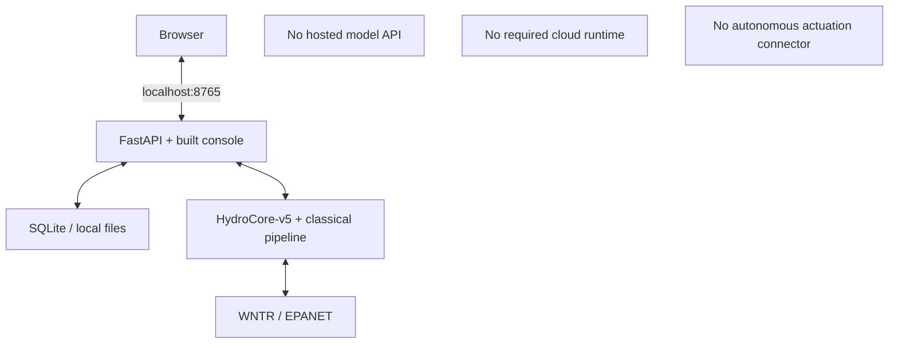

# Installation and offline launch

> **Current model identity:** the source application serves the frozen HydroCore-v5 bundle through `V5PipelineFactory(resolve_v5_bundle_dir())`. `docker-compose.release.yml` points at the published `v0.2.1` V5 release image (see [Path A](#v5-path-a-published-release-recommended) below), and the same identity is served by a from-source build or a native install.

## Runtime boundary



Current diagram source: [diagrams/offline-deployment-v5.mmd](diagrams/offline-deployment-v5.mmd).

The browser interface is intentionally served on localhost rather than as a hosted web application so network models, incident data, model inference, and hydraulic verification can remain on the operator's machine.

## Requirements

### Published Docker release (recommended)

- Docker Engine or Docker Desktop with Docker Compose v2 (`docker compose`)
- internet access for the initial image pull unless the image is already cached
- roughly 4 GiB available RAM for the small/default local demonstration
- Git only if using the documented `git clone` command
- host Python and Node.js are **not required**

### Docker build from source

- Docker Engine or Docker Desktop with Docker Compose v2 (`docker compose`)
- internet access during the build to obtain base images and third-party dependencies unless already cached
- roughly 4 GiB available RAM for the small/default local demonstration
- Git only if using the documented `git clone` command
- host Python and Node.js are **not required**; they run inside the Docker build

### Native install

- 64-bit Python 3.12+
- Node.js 22+ for a fresh source checkout; `frontend/dist` is generated locally by the setup script
- installation-time internet access to obtain Python/npm dependencies unless already cached
- roughly 4 GiB RAM for the small/default local demonstration
- Linux ARM64 additionally requires `git`, `cmake`, `make`, and a C compiler for the architecture-native EPANET build described below

Runtime internet access is not required by the scientific pipeline after the required image/dependencies are available locally.

## V5 path A: published release (recommended)

This is the simplest path for a judge: no local build, just pull the tested image.

```bash
git clone https://github.com/insightlabs38-pixel/HydroSwarm.git
cd HydroSwarm
docker compose -f docker-compose.release.yml up
```

Then open `http://127.0.0.1:8765`.

`docker-compose.release.yml` pulls `ghcr.io/insightlabs38-pixel/hydroswarm:v0.2.1` -- the published, tested multiarch (`linux/amd64` + `linux/arm64`) judge/release image -- rather than building from this checkout. That image is promoted only after passing the same strict self-test the from-source build runs, so it carries the same V5 identity as [Path B](#v5-path-b-build-the-current-docker-checkout) below. The release compose file publishes `127.0.0.1:8765`, drops Linux capabilities, prevents privilege escalation, uses a read-only root filesystem, and persists `/data` in a named volume.

## V5 path B: build the current Docker checkout

This is the container path to the **current source**, useful when reviewing an uncommitted or in-progress change rather than the tagged release:

```bash
git clone https://github.com/insightlabs38-pixel/HydroSwarm.git
cd HydroSwarm
docker compose build
docker compose up
```

Then open `http://127.0.0.1:8765`.

The current `Dockerfile`:

- copies the frozen `models/hydrocore-v5-release/` bundle;
- sets `HYDROSWARM_V5_BUNDLE_DIR`;
- builds the frontend;
- includes the reference-demo/frozen runtime fixtures;
- runs `run_self_test(strict=True)` during image construction;
- runs the API that defaults to V5.

The developer compose file publishes `127.0.0.1:8765`, drops Linux capabilities, prevents privilege escalation, uses a read-only root filesystem, and persists `/data`.

## V5 path C: native setup and launch

```bash
git clone https://github.com/insightlabs38-pixel/HydroSwarm.git
cd HydroSwarm

./setup_hydroswarm_linux.sh
./start_hydroswarm_linux.sh
```

macOS (Apple Silicon / arm64):

```bash
./setup_hydroswarm_macos.sh
./start_hydroswarm_macos.sh
```

Native macOS support targets Apple Silicon (arm64) only. The frozen runtime requires `torch>=2.5`, for which official macOS Intel/x86_64 binary support is unavailable upstream; `setup_hydroswarm_macos.sh` fails early with this explanation on Intel Macs rather than failing obscurely mid-install.

**Native Linux ARM64:** `wntr` 1.5's bundled EPANET toolkit ships prebuilt binaries for `windows-x64`, `darwin-x64`, `darwin-arm`, and `linux-x64` only -- there is no upstream `linux-arm64` build (confirmed against `wntr/epanet/toolkit.py`; see `docs/ARM_MIGRATION.md`). `setup_hydroswarm_linux.sh` handles this automatically: on `aarch64`/`arm64` hosts, after installing the runtime dependencies it builds the real, official EPANET 2.2 engine for the host architecture (`scripts/build_epanet_arm64.sh` -- the same fix the Docker image applies automatically in its `epanet-builder` build stage) and installs it at `wntr`'s own hardcoded library path, so real WNTR/EPANET **water-quality** simulation (e.g. `GET /api/live-example-inputs`, the Live Example judge path) works out of the box, not just the strict self-test's bounded hydraulic simulation. This requires `git`, `cmake`, and a C compiler on PATH; the setup script fails with a concise, actionable install command if any are missing, and never invokes a system package manager itself. This is an upstream packaging gap worked around locally, not a change to EPANET/WNTR verification semantics -- the exact same official EPANET 2.2 engine is used, just built for the host architecture.

Windows PowerShell:

```powershell
.\setup_hydroswarm_windows.ps1
.\start_hydroswarm_windows.ps1
```

The platform setup scripts create a project-local `.venv`, install dependencies, build the frontend when needed, and finish with the strict application self-test.


## Manual native install

```bash
python -m venv .venv
. .venv/bin/activate
python -m pip install --upgrade pip
python -m pip install -e .
cd frontend
npm ci
npm run build
cd ..
hydroswarm self-test --strict --human
hydroswarm start
```

Windows uses `.venv\Scripts\python`, `npm.cmd`, and the PowerShell launcher as appropriate.

## Verify the final V5 identity

Run:

```bash
hydroswarm self-test --strict
```

The machine-readable report includes `trained_assets.architecture_version`, `trained_assets.model_sha256`, `trained_assets.bundle_dir`, calibration status, bounded inference/simulation checks, resources, frontend assets, and the reference artifact.

For the final frozen system, the model hash must be:

```text
de2b3f56243a1933d1d7c5957cd74a29fade119f7d104ce7f1500b3dd7b6d2a5
```

The release manifest itself is [models/hydrocore-v5-release/runtime_manifest.json](../models/hydrocore-v5-release/runtime_manifest.json), and the authoritative freeze is [FINAL_SYSTEM.md](FINAL_SYSTEM.md).

## Runtime behavior if V5 assets are invalid

The V5 loader verifies:

- release schema;
- five-output runtime allowlist;
- `sentinel` trained-task allowlist;
- feature-schema identity;
- fusion identity;
- release file hashes;
- checkpoint hash;
- calibration artifact identity.

A failure makes the trained V5 assets unavailable and the pipeline fails closed toward classical-safe behavior. It never silently falls back to V4.

## Native Windows versus Linux/Docker

HydroSwarm's exact simulator runs in a killable subprocess with a hard timeout. Linux/macOS can use `fork`; Windows uses `spawn`, which starts a new Python interpreter and re-imports scientific dependencies. As a result, native Windows simulator-heavy workloads have materially higher process-start overhead.

For production-equivalent demo latency and the most exhaustive real-simulator test path on a Windows host, prefer Docker Desktop/WSL2.

## Offline operation

The scientific runtime does not require a hosted model service. The application is designed for local operation with local model, calibration, network, database, and reference assets. Dependency downloads and container/image acquisition are installation concerns, not runtime inference dependencies.

## Troubleshooting

- Port occupied: pass `--port` to `hydroswarm start`.
- Strict self-test says V5 assets unavailable: inspect the reported `bundle_dir`, fallback reason, and checkpoint hash.
- Frontend missing: rebuild `frontend/dist`.
- WNTR/EPANET check fails: verify the installed simulator dependency/runtime.
- Do not delete the incident database to “fix” a migration or evidence inconsistency; preserve the record and inspect the error.
- If validating V5 against an older tag (e.g. `v0.1.x-hackathon`), be aware those historical release artifacts are the pre-V5 bundle; use the published `v0.2.1` release or the current source checkout for V5.

## Reproducibility checks

Useful non-locked checks include:

```bash
hydroswarm self-test --strict
python -m pytest
python -m pyright
python -m ruff check src tests scripts
```

These commands do not authorize rerunning the final locked M11.6 evaluation. See [Reproducibility](REPRODUCIBILITY.md).
