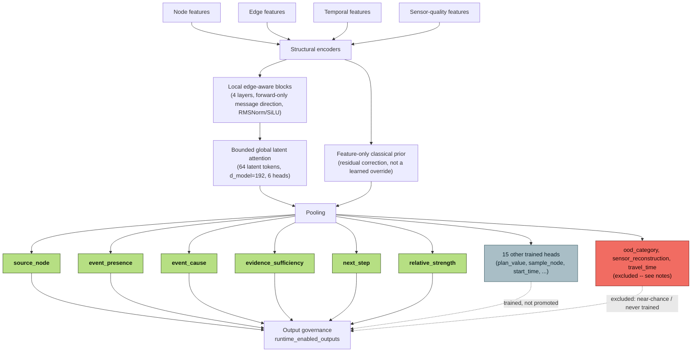

# HydroCore Model Card

> **The frozen, shipped default is HydroCore-v4** (4.18M parameters, `small` variant),
> not the S/M/L generation this card describes below. See
> [Final system](FINAL_SYSTEM.md) for HydroCore-v4's exact identity, hashes,
> runtime-enabled outputs, and measured evaluation. The content below documents the prior
> architecture generation and remains accurate for that generation -- kept for research
> transparency, not as a description of the current default runtime.

(Source: [docs/diagrams/hydrocore-v4.mmd](diagrams/hydrocore-v4.mmd). Source of truth for
every label: `models/hydrocore-v4-release/checkpoint_identity.json` and
`output_governance.json`.)

## Intended use

HydroCore ranks possible contamination sources, estimates evidence sufficiency and sensor
faults, reranks candidate sample locations, and scores structured response actions. It is
an experimental component inside a classical-neural decision-support pipeline. It is not
an autonomous control system and cannot approve or execute a response plan.

## Architecture

The large configuration uses 8 local/global hydraulic blocks, width 360, 8 attention
heads, FFN width 1080, structural/temporal/sensor-quality encoders, and residual specialist
adapters for HydroSentinel (32), HydroScout (48), and HydroStrategist (64). The exact S/M/L
parameter counts are **4,040,645 / 12,401,861 / 24,415,397**. `parameter_report()` exposes
the count by subsystem. Source logits learn a residual correction over the training-only
classical signature prior and explicitly mask reservoirs/tanks as invalid sources.

The model accepts masks for missing sensor values and padded nodes. It retains node-level
representations for source, sample, fault, and action pointer-style heads. Physics masks
and exact WNTR verification remain outside and authoritative over the network.

## Calibration and abstention

Source distributions are fused with a classical signature posterior using a dynamic trust
coefficient based on sensor health, missingness, residuals, hydraulic uncertainty,
entropy, OOD score, and Jensen-Shannon disagreement. Split-conformal candidate sets target
90% marginal coverage. On 200 held-out hydraulic-shift scenarios, coverage is 91.0%, mean
set size is 0.92, and ECE is 0.0269.
High disagreement, OOD evidence, poor sensor health, invalid networks, an unseen topology
hash, or failure to find a safe plan forces inspection or abstention.

## Limitations

- A trained HydroCore-S checkpoint and equal-budget HydroMono-S checkpoint are bundled.
  HydroCore-M completed 17 epochs under a 2,400-second budget but failed its promotion gate;
  its candidate weights remain outside the runtime default. L is untrained.
- The primary held-out evidence uses one topology under a withheld hydraulic regime. A
  separate seven-junction transfer experiment correctly enters `CAUTION`, but its low
  accuracy and 27.1% conformal coverage do not establish cross-topology capability.
- M start-time and strength-bin accuracy improve to 27.0% and 45.5%, while duration falls
  to 35.5%. All three profile heads remain weak and exploratory.
- Synthetic performance does not imply utility-network performance.
- Source strength and mass consequences depend on assumptions about contaminant behavior.
- Conformal coverage is marginal on the calibration distribution, not a per-incident or
  arbitrary-distribution guarantee.
- The default model size is an engineering target, not evidence that it is more capable.

## Promotion gate

Any larger model should only replace the promoted S or classical fallback if held-out testing
shows a meaningful operational gain: at least five percentage points better incident
resolution, 20% fewer samples at matched localization, 30% fewer invalid plans, improved
unseen-network robustness/calibration, or lower verified-plan regret. M did not meet this
gate: hybrid top-1 was 94.0% versus 96.0% for S, with 2.7x higher mean inference latency.
