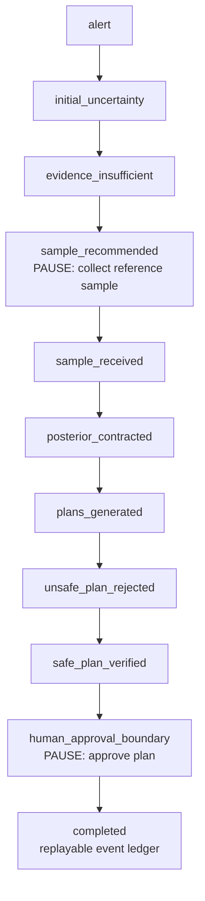

# Reference demo

The **REFERENCE INCIDENT** is a deterministic, checksummed, progressive replay of
HydroSwarm's frozen, WNTR-backed golden scenario. It is a product/workflow demonstration,
not final HydroCore-v5 benchmark evidence. Every value traces back to a real run of
`scripts/run_golden.py`'s `GoldenScenarioRunner` and the frozen scenario/network fixtures.

Label: `REFERENCE INCIDENT · VERIFIED REPLAY`. Supporting copy: *"Replaying a checksummed
HydroSwarm reference workflow generated from the frozen WNTR-backed scenario. Not live
telemetry."*

## How to see it

- **From a running instance:** choose **Run Reference Incident** on first launch, or navigate to `/?experience=reference`.
- **Regenerate the artifact:** `python scripts/build_reference_demo.py` writes `artifacts/reference-demo/reference-incident-v1.json` and `manifest.json`.
- **Served by the backend:** `GET /api/reference-demo`, resolved by `hydroswarm.runtime.paths.resolve_reference_demo_path`.

For the current V5 serving identity, use [Final system](FINAL_SYSTEM.md). The reference-demo
resolver is independent of model-bundle selection.

## Workflow

Source: [diagrams/reference-incident-flow.mmd](diagrams/reference-incident-flow.mmd).

There are two meaningful pauses: evidence collection and human approval. The replay never assumes that a sample was collected or that a response was approved without the corresponding explicit action.

## Stage-correctness

The generated artifact reveals fields only after the underlying frozen workflow has produced them:

- alert: incident only;
- initial uncertainty/evidence insufficient: broad candidate region;
- sample recommended: recommendation before sample arrival;
- sample received: raw evidence before posterior recomputation;
- posterior contracted: updated source belief;
- plans generated: proposals, not yet verified;
- unsafe plan rejected: rejection appears after verification;
- safe plan verified: verified modeled outcome appears;
- human approval boundary: selected verified plan still unapproved;
- completed: approval and final audit hash appear.

## Calibration semantics

The deterministic-classical reference replay does not run the live V5 split-conformal pipeline. It therefore must not display live calibration coverage as if it were current model evidence. A LIVE incident retains current calibration/applicability fields.

## What the reference incident proves—and does not

It is strong evidence that the product can present the intended governed workflow, provenance labels, exact-plan verification states, human pause, and replay.

It does **not** establish V5 predictive accuracy, locked-test performance, novel-topology generalization, or field safety. Those claims belong to [Scientific evidence](SCIENTIFIC_EVIDENCE.md).

## Validation

The repository's reference-demo end-to-end tests check deterministic artifact construction, hash ties, stage ordering, candidate/sample behavior, verification status ordering, no premature approval, and completion only after the human approval event.
