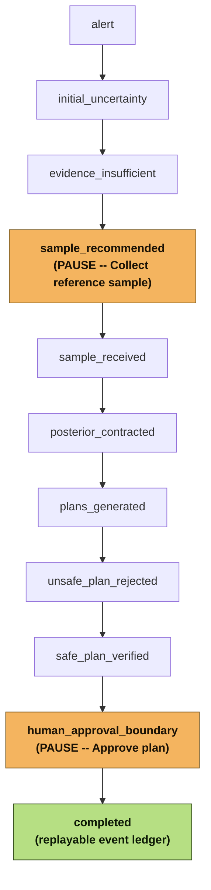

# Reference demo

The **REFERENCE INCIDENT** is a deterministic, checksummed, progressive replay of
HydroSwarm's frozen, WNTR-backed golden scenario -- the primary judge demo path
(submission.txt SS4-6). It is generated, not scripted: every value in it traces back to a
real run of `scripts/run_golden.py`'s `GoldenScenarioRunner`, the same frozen scenario
`data/frozen/golden_scenario.json` and `data/frozen/golden_network.inp` describe.

Label: `REFERENCE INCIDENT · VERIFIED REPLAY`. Supporting copy: *"Replaying a checksummed
HydroSwarm reference workflow generated from the frozen WNTR-backed scenario. Not live
telemetry."*

## How to see it

- **From a running instance:** on first launch with no incident configured, choose
  **Run Reference Incident** (recommended) on the first-launch screen. Or navigate
  directly to `/?experience=reference`.
- **Regenerate the artifact:** `python scripts/build_reference_demo.py` writes
  `artifacts/reference-demo/reference-incident-v1.json` and `manifest.json`. Deterministic:
  the same frozen inputs and code version produce the same `artifact_sha256`.
- **Served by the backend:** `GET /api/reference-demo` (resolved through
  `hydroswarm.runtime.paths.resolve_reference_demo_path`, the same env-var-first pattern
  as the frozen V4 bundle -- see [Final system](FINAL_SYSTEM.md)).

## The 11 milestones

(Source: [docs/diagrams/reference-incident-flow.mmd](diagrams/reference-incident-flow.mmd).)

There are two real, meaningful pauses -- not one. Each milestone advances automatically
after a few seconds (or manually, with the Next control) *except*:

- `sample_recommended`, which pauses for **Collect reference sample** -- HydroSwarm never
  assumes a sample was taken; an operator/judge explicitly triggers evidence collection.
- `human_approval_boundary`, which pauses for **Approve plan** -- HydroSwarm never
  executes a response autonomously, even in a replay.

Both pauses are declared in the artifact itself (`pause_action` /
`pause_action_label` on the milestone), not hard-coded in the frontend as "the only pause
must mean approval" -- see `EXPECTED_PAUSE_ACTIONS` in
`hydroswarm.evaluation.reference_demo` and `ReferenceController.performPauseAction` in
`frontend/src/reference/useReferenceIncident.ts`. Reduced motion disables automatic
advancing entirely; every milestone becomes a manual step, never a fake wait.

## What each milestone reveals -- and does not

The generator (`hydroswarm.evaluation.reference_demo.build_reference_incident_artifact`)
enforces stage-correctness with internal assertions, not just convention: a milestone's
`incident_view` only contains fields whose value the golden workflow had actually computed
by that milestone's last event.

- `alert`: no candidates, no plans -- just the incident opening.
- `initial_uncertainty` / `evidence_insufficient`: a broad, uniform 4-candidate region;
  evidence explicitly flagged insufficient to plan.
- `sample_recommended`: the real expected-information-gain recommendation (J2), before any
  sample has arrived.
- `sample_received`: the raw sample value is shown, but candidate probabilities are still
  the **pre-sample** values -- the posterior has not been recomputed yet.
- `posterior_contracted`: the real updated posterior appears for the first time.
- `plans_generated`: two real candidate plans, **neither yet verified**.
- `unsafe_plan_rejected`: the unsafe plan's real `REJECTED` verification appears; the safe
  plan is still unverified at this exact milestone.
- `safe_plan_verified`: both real verification outcomes are now visible.
- `human_approval_boundary`: the verified plan is selected and awaiting approval --
  `approved_plan_id` is still null here.
- `completed`: approval and the real final event hash both appear, and "Explore full
  replay" routes into the Replay workspace to inspect the real, hash-chained event ledger.

## Schema and validation

Artifact schema: `schema_version`, `reference_id`, `generator`, `generated_at`,
`source_commit`, `golden_result_hash`, `final_event_hash`, `event_count`,
`network_topology` (the real frozen network's node/link/coordinate metadata -- never
borrowed from the hand-authored `DEMO_FALLBACK` fixture), and `milestones[]`.
`artifact_sha256` covers everything except `generated_at` (a wall-clock timestamp), so
regenerating on unchanged inputs reproduces the same hash.

Validation: `tests/e2e/test_reference_demo.py` (12 cases, `real_simulation`-marked) proves
determinism, hash ties to the golden result, contiguous event coverage, the broad initial
candidate set, the correct sample recommendation, posterior-only-after-sample-receipt,
REJECTED/VERIFIED only after the verifier stage, no premature approval, and completion
only after human approval.
