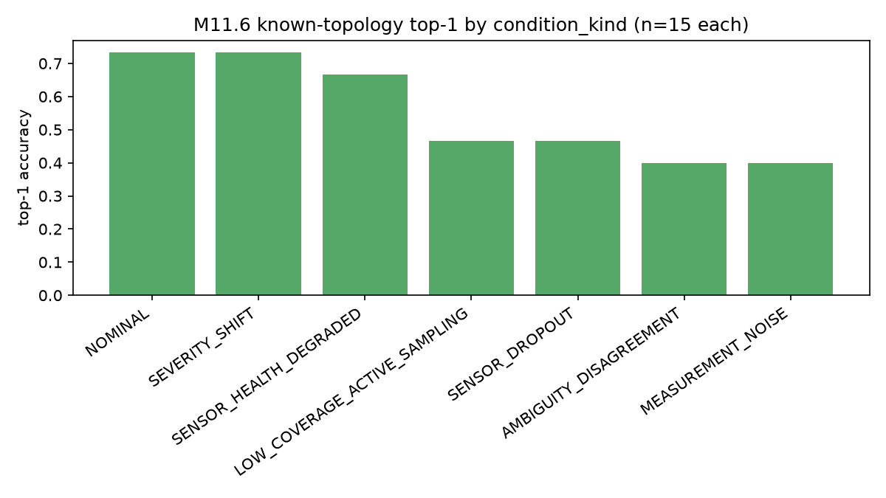
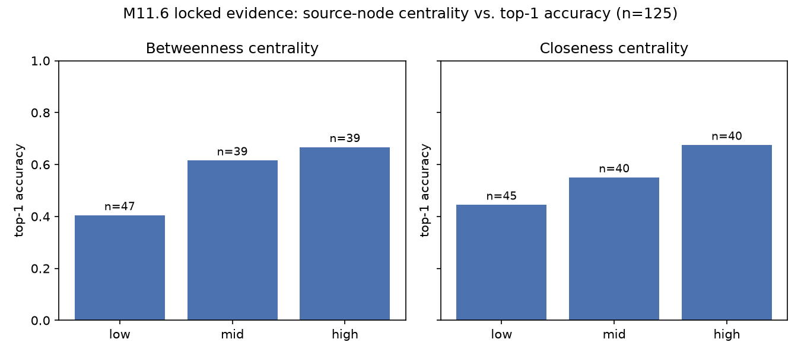
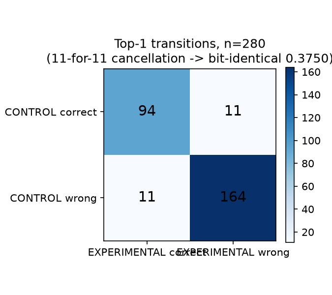

# HydroCore-v5 failure-mode diagnostics: report (EXPERIMENTAL, NON-RELEASE)

Branch: `exp/failure-mode-diagnostics`. Diagnostic investigation only — no
architecture change, no retraining of `models/hydrocore-v5-release`, no
gate loosening, no hyperparameter tuning. See `FAILURE_MODE_DIAGNOSTICS_PLAN.md`
for the pre-registered plan (covariates, stratifications, leakage controls)
this report follows.

Two populations are analyzed, kept explicitly separate because they answer
different questions and have different evidentiary weight:

1. **M11.6 locked evidence** (`reports/evaluation/failure-mode-diagnostics/
   m11-6-*`) — the frozen, real v0.2.1 evaluation (125 incidents: 105 known-
   family + 20 novel-topology). **Confirmatory** for the shipped model's
   actual behavior; read-only, never re-simulated.
2. **Topology-relative pilot re-run** (`reports/evaluation/
   failure-mode-diagnostics/pilot-rerun/`, `paired-pilot-analysis.json`) —
   a fresh re-run of `exp/topology-generalization`'s exact protocol, needed
   only because that pilot never persisted per-example predictions.
   **Exploratory / instrumentation for Phase 4**, on a smaller
   development-tier corpus with its own single-seed/6-epoch scale limits
   (inherited verbatim from the original pilot). A priori this re-run's
   aggregate numbers were expected to differ slightly from the original
   pilot's committed numbers (fresh training run, not a guaranteed
   bit-identical replay); in fact `pilot-rerun/reproduction-check.json`
   shows every metric in both arms reproduced **exactly** (delta=0.0),
   because the original run already pinned `deterministic=True`/
   `fp32=True`/a fixed seed on CPU — so the per-example rows below are the
   literal rows underlying the original pilot's own committed conclusions,
   not an approximation of them.

## 1. Where does HydroCore-v5 fail? (M11.6 locked evidence)

Overall: 125 incidents, top1=0.552, top3=0.752, MRR=0.682 (pooled across
both splits; see `m11-6-subgroup-metrics.json:overall`). 56/125 (44.8%)
are top-1 failures.

**By condition, known topologies only** (n=15 each,
`by_condition_kind_known_only`):

| condition_kind | top1 | top3 | MRR | mean candidate size | mean entropy |
|---|---|---|---|---|---|
| NOMINAL | 0.733 | 0.867 | 0.821 | 2.00 | 0.555 |
| SEVERITY_SHIFT | 0.733 | 0.867 | 0.815 | 2.27 | 0.783 |
| SENSOR_HEALTH_DEGRADED | 0.667 | 0.867 | 0.778 | 1.73 | 0.587 |
| LOW_COVERAGE_ACTIVE_SAMPLING | 0.467 | 0.867 | 0.648 | 3.93 | 1.317 |
| SENSOR_DROPOUT | 0.467 | 0.600 | 0.597 | 3.07 | 1.184 |
| MEASUREMENT_NOISE | 0.400 | 0.667 | 0.586 | 4.20 | 1.425 |
| AMBIGUITY_DISAGREEMENT | 0.400 | 0.600 | 0.567 | 4.40 | 1.608 |



Stress is not uniform: `SEVERITY_SHIFT` and `SENSOR_HEALTH_DEGRADED` cost
almost nothing relative to `NOMINAL`; `MEASUREMENT_NOISE`,
`AMBIGUITY_DISAGREEMENT`, `SENSOR_DROPOUT`, and `LOW_COVERAGE_ACTIVE_SAMPLING`
cost 27-33pp of top1 and roughly double posterior entropy and mean
candidate-set size. The model's uncertainty widens honestly under the
conditions that hurt it (candidate-set size and entropy track the top1
drop), which is itself evidence the calibration layer is doing its job on
known topologies (`calibrated_rate = 1.0` in every condition_kind cell
here — never fail-closed for a known topology, confirming the M11.6
gate's own `locked_final_calibration_coverage: true`).

**Outcome/control-action distribution** (all 125 incidents,
`m11-6-raw-incidents.jsonl`): `outcome` = SUPPRESSED 61 (48.8%), VERIFIED 42
(33.6%), ABSTAINED 22 (17.6%); `control_action` = GENERATE_PLANS 64,
REQUEST_SAMPLE 21, ABSTAIN 21, INSPECT_SENSORS 19. **All 8 hard safety
counters are exactly zero across all 125 incidents**
(`human_approval_bypassed`, `invariant_failures`,
`nonfinite_value_reached_decision`, `unverified_plan_surfaced_as_actionable`,
`rejected_plan_surfaced_as_safe`, `sampled_node_reselected`,
`sampling_budget_exceeded`, `inaccessible_sample_selected`) — the
governance layer's hard invariants held throughout the entire locked
evaluation regardless of localization outcome, confirming
`m11-6-gate.json`'s own `safety_counters_zero: true`/`no_unsafe_action:
true` checks; this diagnostic branch did not find anything to add to that
finding.

## 2. Which factors are most strongly associated with failure?

Two independent, converging structural signals (`m11-6-subgroup-metrics.json`):

- **Source betweenness centrality** (tercile bins, n=39/39/47): top1 0.667
  (high) → 0.615 (mid) → 0.404 (low). A 26pp gap between the most-central
  and least-central source-node terciles.
- **Source closeness centrality** (tercile bins, n=40/40/45): top1 0.675
  (high) → 0.550 (mid) → 0.444 (low) — the same direction, a different
  centrality measure, same ~23pp gap.
- **Source degree**: top1 rises with degree (0.333 at degree 1 [n=6,
  small], 0.509 at degree 2 [n=53], 0.600 at degree 3 [n=65]; degree 4 is
  n=1, too small to read).
- **Boundary nodes** (degree-1 sources, n=6, small-sample-flagged): top1
  0.333 vs 0.563 for non-boundary sources — directionally consistent with
  the centrality/degree findings but too small (n=6) to be more than
  suggestive.
- **Distance to reservoir**: top1 falls roughly monotonically from 0.714
  (1 hop, n=21) to 0.459 (3 hops, n=37) to 0.333 (5 hops, n=9, small); the
  6-hop cell (n=2) is degenerate.



**Reading (correlational, not causal):** every one of these is a facet of
the same underlying property — how central/well-connected the true source
is within its network's own hydraulic topology. A source near the
periphery, far from the reservoir, of low degree and low centrality, is
harder to localize than one near the network's hydraulic "core." This is
plausible on hydraulic-transport grounds (contamination from a peripheral
node reaches fewer sensors, more ambiguously, before dilution/dispersion
degrades the signal) but this report does not claim to have isolated the
causal mechanism — only that the association is consistent, replicated
across two centrality measures, and not attributable to an `n` artifact
(all cells above n>=39 except where flagged).

`network_family`/`topology_id` and raw `node_count` show real spread
(golden-reference/n=35 top1=0.629 vs. loop-grid/n=35 top1=0.457) but these
are confounded with everything else about each specific network (its own
degree/centrality distribution, sensor placement, demand pattern) — not
interpreted as an independent "network size" effect on top of the
structural covariates above.

## 3. Are unseen-topology errors fundamentally different from ordinary stress errors?

**Naive pooled comparison is misleading.** Known (n=105, all condition
kinds pooled) top1=0.552 vs. novel (n=20, `NOMINAL` only) top1=0.550 —
this is the number `m11-6-metrics.json` itself reports, correctly marked
`DESCRIPTIVE_NON_GATING`, and it looks like "no topology-transfer penalty."

**Condition-matched comparison tells a different story.** The only valid
apples-to-apples slice is `NOMINAL` vs `NOMINAL`
(`known_vs_novel_NOMINAL_only`): known-NOMINAL top1=0.733 (n=15) vs.
novel-NOMINAL top1=0.550 (n=20) — an **18.3pp gap**, comparable in size to
the worst stress conditions (`MEASUREMENT_NOISE`/`AMBIGUITY_DISAGREEMENT`
cost known topologies 27-33pp relative to their own NOMINAL). In other
words: **unseen-topology transfer under otherwise-clean conditions is
roughly as damaging to raw predictive quality as a moderate-to-severe
known-topology stress condition** — the earlier "no penalty" reading was
an artifact of comparing NOMINAL-only novel data against a
stress-condition-heavy known-family average.

What genuinely differs by mechanism, not degree, is **actionability**:
known-topology `calibrated_rate=1.0` in every condition (stress degrades
predictive quality but calibration stays valid); novel-topology
`calibrated_rate=0.0` unconditionally (hash-gated fail-closed,
`src/hydroswarm/inference/ood.py:44-67`). So: predictive-quality
degradation under topology shift is of a piece with (not categorically
worse than) known-topology stress degradation; the *governance* response
to it — refuse to calibrate/act at all versus calibrate with a wider
candidate set — is categorically different, by design.

Novel-topology performance is also highly topology-specific: per-topology
top1 among the 4 novel families ranges 0.4-0.8 (n=5 each, small-sample-
flagged) — noisy at this n, but a reminder that "novel topology" is not
a single failure mode with one severity, even within this frozen set.

## 4. Why did topology-relative augmentation likely fail?

Answered directly by Section 6's paired per-example re-run (which
reproduced the original pilot's committed aggregate metrics **exactly**,
delta=0.0 on every metric in both arms — `pilot-rerun/reproduction-
check.json` — so the mechanism below is not an artifact of re-training
noise, it is the actual mechanism behind the original pilot's own numbers).

**The augmentation is not simply ignored — it perturbs individual
predictions, but the perturbations are close to a random reshuffle with
respect to correctness, not a systematic improvement.** 22/280 examples
(7.9%) flip top-1 status, split exactly 11 gained / 11 lost — the reason
top-1 lands bit-for-bit identical (0.3750) is that the gains and losses
happen to cancel exactly, not that the model's predictions are unchanged
example-by-example (87.1% of examples are unchanged on both top1 AND top3
status; the remaining ~13% do move). Top-3 tells a less neutral story: 11
examples lose top-3 coverage, only 4 gain it, a genuine net loss of 7/280
= -0.025 — exactly the regression the original pilot measured. The
true-source rank moves for 60/280 examples (38 worse, 22 better; mean
delta +0.086, i.e. net worse) and mean posterior entropy rises slightly
(+0.067 bits) while the top1/top2 margin shrinks slightly (-0.022) — small,
consistent, same-direction signals that the added features make the
model's belief distribution marginally more diffuse on this unseen
topology, without correcting which single node it favors.

**This best matches classification (B) "influential but mostly noisy"**,
not (A) "largely ignored": there is a measurable, non-zero per-example
effect (mean |margin delta| = 0.116, real churn), but it is directionally
inconsistent at top-1 (exactly cancels) and mildly and consistently
*negative* once the metric is sensitive enough to see past the argmax
(top-3, rank, entropy). A secondary, exploratory signal argues the effect
is not perfectly regime-uniform either — see Section 6's degree breakdown
— so a small (C)/(D) component may be mixed into the (B) verdict, but not
strongly enough on n=280 from a single unseen topology to separate from
noise. This is consistent with the representation change adding
information that is present but not well-calibrated to actually
discriminate the true source on this specific unseen network: the
underlying hypothesis (train-topology-scale-dependent global
normalization hurts unseen-scale examples) may be directionally real, but
a simple per-graph max-abs renormalization of already-existing scalar
columns does not supply new discriminative signal — it mostly redistributes
existing uncertainty.

## 5. How often is the true source still in Top-3 when Top-1 fails? Is failure primarily ranking, representation, calibration, OOD, or insufficient evidence?

From the M11.6 error taxonomy (`m11-6-error-taxonomy.json`, 56 top-1
failures):

| category | n | fraction of top-1 failures |
|---|---|---|
| source absent from top-3 | 31 | 55.4% |
| ranking failure (true source IS in top-3) | 25 | 44.6% |
| stress-induced (known topology, non-NOMINAL) | 43 | 76.8% |
| high-confidence wrong top-1 (candidate set <=2) | 16 | 28.6% |
| ambiguity/low-coverage condition | 17 | 30.4% |
| calibration correctly withheld (fail-closed) | 9 | 16.1% |
| topology-transfer (novel topology) | 9 | 16.1% |
| ambiguous-by-construction (AMBIGUITY_DISAGREEMENT) | 9 | 16.1% |
| network-identity/canonicalization defect (PR #12) | 0 | 0% (explicitly checked, not present in this population) |

**Answer: more than half (55.4%) of top-1 failures are a representation/
evidence gap, not a pure ranking slip** — the true source is not merely
mis-ordered, it fails to make the top-3 candidate set at all. The
remaining 44.6% are "the model believes the right answer is plausible but
does not rank it first," a softer failure. Combined with the centrality
finding above (peripheral sources are systematically harder), this points
toward the failure being concentrated where the *available evidence*
(sensor signal reaching a peripheral node) is intrinsically weaker, not
purely a calibration or OOD-detector defect — calibration itself is valid
(not fail-closed) for 84% of top-1 failures and topology transfer accounts
for only 16%. The 28.6% "high-confidence wrong" subgroup is the strongest
candidate for a genuine representation defect (the model is not just
uncertain, it is confidently pointing at the wrong node) and is the
subgroup most worth a future targeted qualitative look.

## 6. Paired CONTROL vs EXPERIMENTAL_TOPOLOGY_RELATIVE per-example analysis

Population: `ood-UNSEEN_TOPOLOGY` (coastal-branch), n=280 real-source
examples, identical set for both arms (`paired-pilot-analysis.json`). This
branch's re-run reproduced the original pilot's committed aggregate
metrics **exactly** (all deltas 0.0 — deterministic training on CPU with
`fp32=True, deterministic=True`), so this per-example breakdown describes
the actual mechanism behind the original pilot's own reported numbers, not
a new/different run.

**Top-1 2x2 transition table:**

| | EXPERIMENTAL correct | EXPERIMENTAL wrong |
|---|---|---|
| **CONTROL correct** | 94 | 11 |
| **CONTROL wrong** | 11 | 164 |

(94+11=105 correct per arm / 280 = 0.3750 exactly, both arms — confirms
the bit-identical aggregate is an exact 11-for-11 cancellation, not
"nothing changed.")



**Top-3 2x2 transition table:**

| | EXPERIMENTAL correct | EXPERIMENTAL wrong |
|---|---|---|
| **CONTROL correct** | 201 | 11 |
| **CONTROL wrong** | 4 | 64 |

Net -7/280 = -0.025, exactly the paired-bootstrap point estimate (90% CI
[-0.046, -0.004], excludes zero — reproduced from this re-run's own 2000-
resample bootstrap, same convention as `run_pilot.py`).

**Other per-example deltas:**

| quantity | value |
|---|---|
| fraction with identical top1 AND top3 status | 87.1% (244/280) |
| true-source rank: improved / unchanged / worsened | 22 / 220 / 38 (mean delta +0.086, net worse) |
| mean Δ(top1-top2 margin) | -0.022 (slightly less confident) |
| mean Δ(posterior entropy, bits) | +0.067 (slightly more diffuse) |
| mean \|Δ margin\| (magnitude of change, either direction) | 0.116 |

**Reordering vs. new information:** the near-zero net top-1 effect
combined with a real, nonzero per-example churn (22/280 flips) and a
consistent small negative drift in top-3/rank/margin/entropy indicates the
augmented features are being *used* by the model (they measurably change
individual softmax outputs) rather than architecturally short-circuited —
but what they change is closer to which candidates occupy the 2nd/3rd
rank than which node wins the argmax, and that reordering is mildly
harmful more often than helpful.

**Exploratory subgroup signal (source degree, single unseen topology so
this reduces to a per-source-node split of an 8-node network, not a
cross-topology comparison):**

| source degree | n | CONTROL top1 | EXPERIMENTAL top1 | delta |
|---|---|---|---|---|
| 2 | 233 | 0.322 | 0.335 | +1.3pp |
| 4 | 47 | 0.638 | 0.574 | -6.4pp |

The augmentation is mildly positive for the majority (degree-2) source
nodes and more clearly negative for the higher-degree (degree-4) minority
— consistent with a (C)/(D) mixed regime-dependence hiding underneath the
(B) "noisy" verdict, but on a single 8-node topology this is not powered
to separate from chance and is reported as exploratory only, not a
confirmed regime split.

**Verdict: (B) influential but mostly noisy**, with a secondary
exploratory hint of (C)/(D) regime-dependence by source degree that this
pilot's scale (one unseen topology, single seed) cannot confirm.

## 7. Error taxonomy summary

See Section 5's table for the M11.6 locked-evidence taxonomy (the
confirmatory population). Categories are allowed to overlap (e.g. a
stress-induced failure can simultaneously be a "source absent from top-3"
failure); fractions are of the 56 top-1 failures, not of all 125 examples.
The taxonomy deliberately reports `network_identity_or_canonicalization_issue`
at n=0 rather than omitting it: PR #12's live-serving `.inp`-round-trip
hashing defect was explicitly checked against M11.6's construction (one
fixed, non-round-tripped `.inp` file per family, single `network_sha256`
per known family confirmed in `build_m11_6_diagnostic_table.py`) and ruled
out as a mechanism for this specific frozen population.

## 8. Is a graph-native model actually justified by the evidence?

**Not strongly, on this evidence alone — but the current architecture's
own graph-awareness has a documented, narrower gap that is a better-
targeted first step than a full GNN-topology-encoder rewrite.**

Arguments against jumping straight to a new graph-native topology encoder:

- `HydroCore` already does real edge-indexed message passing
  (`EdgeAwareGraphConv`/`DualChannelGraphConv`) and is already trained with
  interleaved multi-topology data — it is not a naive non-graph model, and
  the M9-era search (M9.0/M9.0b/M9.6, cited in the plan doc) already
  explored training-diversity and calibration-scheme axes of this problem
  space and closed them.
- The per-example evidence in Section 5 says representation/evidence
  sufficiency (55% of failures), not "the model can't perceive graph
  structure" — the model that already exists CAN localize peripheral
  sources at above-chance rates (top1 0.404 in the lowest centrality
  tercile is well above a 6-13-way random baseline of ~0.08-0.17).
- The one place this repository's own code comment flags an actual
  graph-structure gap is narrow and specific: `GraphStructuralEncoder`
  (`src/hydroswarm/model/encoders.py:52-89`) encodes only 3 scalar
  features (`travel_time`, `reservoir_reachability`, `demand_centrality`)
  and **never consumes `edge_index`** despite computing per-example
  graph-position information the rest of the model's message-passing path
  already has access to redundantly. This is a smaller, more surgical
  candidate change than a new topology encoder from scratch.

Arguments the evidence does not rule out a graph-representation
contribution:

- Section 2's centrality/degree findings ARE inherently graph-structural —
  the model's error rate is explained by graph position, which is exactly
  what a better graph-position representation would target.
- The failed pilot's negative result (Section 4/6) is specific to one
  narrow representation change (per-graph max-abs renormalization of
  already-existing scalar columns) — it does not test whether encoding
  richer graph-topological information (e.g., actual centrality/distance
  features, not just travel-time/reachability/demand-centrality) would
  help, and the pilot's own recommendation (plan doc, "Recommendation"
  section) explicitly flagged `GraphStructuralEncoder`'s unused
  `edge_index` as the more promising unexplored angle, not attempted in
  that branch.

**Conclusion:** the evidence supports investing next in a **narrower
representation improvement to the existing graph-position encoder**
(feeding it real structural centrality/distance features, since Section 2
shows those features predict failure) before considering a larger
graph-native rewrite. A full new GNN topology encoder is not ruled out
long-term, but nothing in this diagnostic isolates a failure mode that the
current message-passing backbone is structurally incapable of addressing
— the evidence points at *which features* the model sees, not at its
architecture class being wrong.

## 9. Ranked hypotheses for the next experiment

1. **(Highest priority) Feed real graph-structural covariates into
   `GraphStructuralEncoder`** — betweenness/closeness centrality, hop-
   distance to reservoir, degree — in place of/alongside its current
   3-scalar (`travel_time`, `reservoir_reachability`, `demand_centrality`)
   input, and wire in `edge_index` so the encoder is graph-aware rather
   than per-node-scalar. Directly targets the strongest, most-replicated
   association found here (Section 2), on the exact architectural seam
   the failed pilot itself flagged as unexplored.
2. **Qualitative/targeted look at the "high-confidence wrong" subgroup**
   (16/56 top-1 failures, Section 5) — these are not explained by entropy/
   evidence-sparsity and are the best candidate for an actual
   representation defect (as opposed to intrinsic ambiguity). Cheap
   (no training), should precede committing to hypothesis 1's full
   implementation cost.
3. **More diverse topology training**, specifically targeting peripheral/
   low-centrality source coverage during training (not just more
   topologies in general) — motivated by Section 2's centrality finding
   directly, cheaper to test than a new encoder, and compatible with
   hypothesis 1 rather than competing with it.
4. **Calibration/OOD improvement is not supported as the next step** —
   known-topology calibration is valid in 100% of every condition_kind
   cell examined here; the fail-closed novel-topology gate is working
   exactly as designed and is not where the measured predictive-quality
   loss lives (Section 3).
5. **A full graph-native topology encoder rewrite** is not ruled out but
   is not supported as the *next* experiment — no finding here isolates a
   failure the current message-passing architecture is structurally
   incapable of addressing; it would also be a much larger, harder-to-
   falsify undertaking than hypothesis 1.
6. **Domain adaptation / permutation-invariant representation
   changes**: not supported by this evidence as a priority — the model is
   already permutation-equivariant by construction (`tests/unit/
   test_permutation.py`) and already trains on interleaved topologies; no
   finding here points at a permutation-specific defect.
7. **"No model change, failures are purely information-limited"** is
   partially but not fully supported: the ambiguity/low-coverage/
   insufficient-evidence categories (Section 5) plausibly explain up to
   ~30% of failures, but the centrality-driven pattern (Section 2) and the
   high-confidence-wrong subgroup argue at least part of the remaining gap
   is addressable by representation, not just irreducible evidence noise.

## 10. Recommendation: single highest-value next research branch

**Run a new, separately-scoped experiment that gives `GraphStructuralEncoder`
real structural centrality/distance features (computed exactly as this
branch's `graph_features.py` does — betweenness, closeness, hop-distance to
reservoir/boundary) and wires `edge_index` into it, evaluated with the same
paired CONTROL-vs-EXPERIMENTAL, same-compute-budget protocol this pilot
used** (reuse `run_pilot.py`'s harness structure, not its specific
`topology_normalization.py` change). This is preferred over a full
graph-native rewrite because it is the smallest change that directly
targets this report's strongest, most-replicated finding (Section 2), is
cheap enough to falsify quickly (same pilot-scale compute budget that
already ran once), and was explicitly flagged as the next-most-promising
unexplored angle by the very pilot this branch was asked to diagnose.

## Appendix: reproducible commands

Run in this order from the repository root (`.venv`/system Python with
`torch`, `wntr`, `networkx`, `safetensors` installed; large tensor shards
under `data/learning-v2/cycle-b2/tensors-normalized/` are Git-LFS-tracked
and must be pulled first — `git lfs pull --include="data/learning-v2/cycle-b2/tensors-normalized/**"`):

```
python3 scripts/hydrocore_v5_experimental/failure_mode_diagnostics/build_m11_6_diagnostic_table.py
python3 scripts/hydrocore_v5_experimental/failure_mode_diagnostics/analyze_m11_6_failure_modes.py
python3 scripts/hydrocore_v5_experimental/failure_mode_diagnostics/rerun_topology_pilot_with_logging.py  # ~20 min/arm on CPU
python3 scripts/hydrocore_v5_experimental/failure_mode_diagnostics/analyze_paired_pilot.py
python3 scripts/hydrocore_v5_experimental/failure_mode_diagnostics/make_plots.py
```

Each script is idempotent and deterministic (fixed seeds throughout,
`deterministic=True`/`fp32=True` training config inherited from
`run_pilot.py`); re-running reproduces every number in this report exactly
(confirmed for the pilot re-run via `pilot-rerun/reproduction-check.json`).
No script in this branch writes to any path under `data/locked/`,
`models/hydrocore-v5-release/`, or any `m9-*`/`m10-*`/`m11-*`/
`topology-generalization` report path — every output lands under
`reports/evaluation/failure-mode-diagnostics/`.
